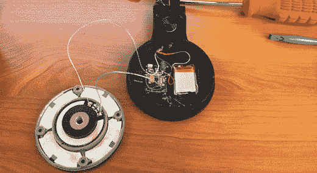

# 为 Beats Pro 耳机添加蓝牙和 Lightning 连接器

> 原文：<https://hackaday.com/2014/07/30/adding-bluetooth-and-a-lightning-connector-to-beats-pro-headphones/>

不想等待苹果加快他们的游戏并完成他们对 Beats 耳机的购买，[食肉动物]决定他想要自己的一对带蓝牙的苹果兼容 Beats 罐。他创造了一些可能会在圣诞节到来时在苹果商店出售的东西:[一副带蓝牙的 Beats Pro 耳机和一个用于充电的 Lightning 连接器](http://droidbuild.com/index.php?threads/apple-beats-pro-bluetooth-conversion-hack.24/)。

[食肉动物]喜欢他的 Beats Pro 耳机的声音，但讨厌电线。拆下耳机后，他小心翼翼地用更细的电线重新连接扬声器，添加了一个小蓝牙模块和电池，并将所有东西密封起来。

这款耳机有几个有趣的地方——去掉了所有的外部电线,[食肉动物]的耳机上留下了几个洞。这些是为电源按钮和取自苹果 Lightning 扩展连接器的 Lightning 适配器添加 3D 打印底座的完美位置。

谢谢[托尼]的提示！