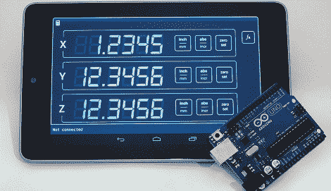

# 向非数控铣床添加数字读数

> 原文：<https://hackaday.com/2012/09/24/adding-digital-readout-to-a-non-cnc-mill/>

为了在他的研磨机上增加一个数字读数器，[塞维多夫]做了大量的功课。他采购了三个非常强大的秤，研究了他的 DRO 应该基于什么样的硬件，甚至使用七段 led 制作了一个非常酷的显示器。经过近一年的工作，【塞维多夫】终于发现了一个不错的东西:一个 Arduino 和一个 Android 平板电脑，完美匹配的[我们见过的最漂亮的机器商店展示之一](http://www.yuriystoys.com/2012/09/do-it-yourself-dro-with-arduino-and.html)。

[塞维多夫]基于他从 Grizzly 买的三个电子秤。这些秤固定在他的磨的框架上，并将数据发送到它们自己的显示器上。Arduino 用于从这些秤中提取数据，并通过蓝牙发送到 Nexus 7 Android 平板电脑。

考虑到仅仅基于 Arduino 和字符 LCD 的 DRO 看起来有点笨拙——事实上 Arduino 不能进行浮点运算——我们真的对[塞维多夫]非常优雅的解决方案印象深刻。

谢谢[李]送来这封信。