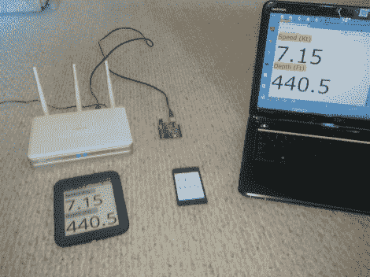

# 向帆船添加 EPaper 导航数据

> 原文：<https://hackaday.com/2012/09/07/adding-epaper-navigation-data-to-a-sailboat/>

[Mike Holden]一直在寻找一种在明亮的阳光下易于阅读的显示器。他想用它来读出他帆船上的导航数据。最好的选择是电子纸显示器。他设法建立了一个系统，将更新 NMEA 0183 数据输入到一个 Nook 简单的触摸界面。

NMEA 0183 是一种管理来自海洋导航设备的数据的协议。最明显的是 GPS，但也有很多可能性，如声纳、陀螺罗盘和自动驾驶仪。为了让事情运转起来，他写了一个 Arduino 草图，使用标准生成虚拟包。这使他能够在不接触任何真实设备的情况下开发和测试系统。这个建筑的核心是一个 WiFi 路由器。它使用 RS232 到 USB 转换器电缆通过 USB 端口接收数据。Python 脚本解析数据并生成每秒刷新一次数据的网页。这是使用 Nook 上的 Opera 浏览器加载的

休息之后，请观看视频，观看系统演示。

[https://www.youtube.com/embed/RY35P23roGA?version=3&rel=1&showsearch=0&showinfo=1&iv_load_policy=1&fs=1&hl=en-US&autohide=2&wmode=transparent](https://www.youtube.com/embed/RY35P23roGA?version=3&rel=1&showsearch=0&showinfo=1&iv_load_policy=1&fs=1&hl=en-US&autohide=2&wmode=transparent)