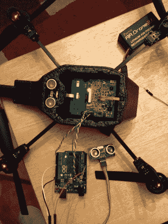

# 向 Parrot AR 无人机添加基于 Node.js 的传感器

> 原文：<https://hackaday.com/2012/11/28/adding-node-js-based-sensors-to-the-parrot-ar-drone/>

[Max Ogden]想要为他的 Parrot AR 无人机添加传感器。这是一个运行 Linux 的商用四轴飞行器。这使得他很容易[使用 Node.js 从 Arduino 板上读取传感器](https://gist.github.com/4152815)。Arduino 的使用仅仅是为了简单的原型制作。它只需要将无人机的串行端口与传感器的传输方法连接起来，因此几乎任何微控制器都可以取代它。

有一些硬件方面的考虑要考虑。制造商很好地在串行端口上填充了一个 0.1 英寸间距的引脚插座(如果这种摆弄硬件的邀请是行业标准就好了)。但该设备要求 3.3V 电平，因此相应地选择您的硬件。有一位评论者亲自尝试了这个项目，发现无人机无法在 Arduino 已经连接的情况下启动——他必须启动，然后完成连接。除了麻烦之外，这使得添加自己的传感器有效载荷非常简单，你不必等到着陆才能获得数据。

也许我们需要在[我们的电击驱动](http://hackaday.com/2012/08/27/the-taserdrone-a-shocking-mod-for-the-ar-drone/)中添加一些电击电压数据报告。