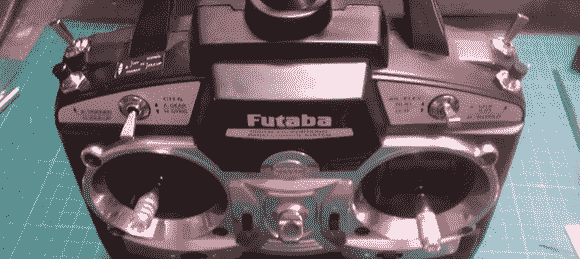

# 向 RC 发射器添加肩钮

> 原文：<https://hackaday.com/2013/01/26/adding-shoulder-buttons-to-an-rc-transmitter/>

[杰拉德]做木偶和电子动画工作，并远程控制他的创作和角色，他使用现成的遥控无线电。这是你基本的 6 通道设置，但[Gerard]想要一种通过按下按钮来控制眨眼和其他简单动作的方法。当然，他可以使用发射器上的拨动开关，但他想要一种不需要再次打开和关闭伺服系统的东西。为了解决这个问题，[Gerard] [在他的发射器](http://theeffectslab.com/forums/viewtopic.php?f=10&t=19859)上增加了肩部按钮，只需要一点点焊接。

[杰拉德]的发射器使用拨动开关在第五和第六频道发送信号。要添加按钮，他只需在塑料外壳上钻一个洞，安装一对按钮，并将它们并联到拨动开关上。

现在[杰拉德]在第五和第六频道上有瞬时开关，完美地让他的作品闪烁。由于按钮与开关并联，轻击开关到“开”的位置实际上是将按钮从电路中取出，以防发射器被推挤。