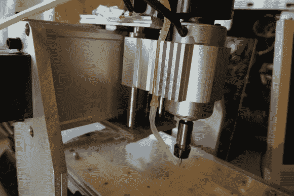

# 给你的数控机床增加主轴方向和冷却剂控制

> 原文：<https://hackaday.com/2014/06/20/adding-spindle-direction-and-coolant-control-to-your-cnc-machine/>

[Peter]又回来了，再次改装他的 CNC3020 路由器。这次他增加了一个[冷却系统和主轴方向控制](http://lab.whitequark.org/notes/2014-06-16/cnc3020t-coolant-pump-and-ccw-rotation/)。如果你曾经尝试过用磨机、刳刨机甚至带锯切割有机玻璃，那么你就会知道这些塑料碎片熔化在一起并在切割工具后面形成一条坚硬的胶粘物痕迹是很常见的。降低主轴速度有一点帮助，但冷却系统的目的是消除球状混乱在一起。

冷却剂流似乎是开环的，这意味着初始冷却剂贮存器不会自动补充。冷却剂从一个容器开始，通过一个泵经由一根硅树脂软管输送。在软管的末端，有一个安装在 Z 轴上的喷嘴，将冷却液流指向刀头。喷嘴是塑料的，由重新设计和改进的焊剂应用容器制成。[Peter]利用了机器的底座由开槽挤压铝制成。床收集冷却剂，然后冷却剂沿着通道流到机器的前面，在那里冷却剂被收集在定制的容器中。这个有机垃圾箱的零件实际上是用这台机器切出来的！然后重力将这个容器中的物质排入另一个位于较低高度的容器中。

信不信由你，这些相对便宜的数控机床的控制板有一堆隐藏的功能。其中之一是主轴方向的连接，它甚至被丝网印刷在 PCB 上。[Peter]接入控制板上的这些点并将它们连接到他自己设计的定制中继板上。该板装有一个用于冷却液泵的 SPST 继电器和一个用于反转主轴极性的 DPDT 继电器。

随着新电路板的就位和连接，主轴方向和冷却液都可以通过 g 代码命令由 [LinuxCNC](http://www.linuxcnc.org/) 控制。如果您有一台 CNC3020 或 CNC3040 路由器，并希望提高其性能，请查看[Peter 的]以前的项目；[电源升级](http://hackaday.com/2014/06/01/cnc-3020-router-gets-a-power-supply-upgrade/)、 [PWM 主轴控制和限位开关](http://hackaday.com/2014/02/15/chinese-3020-cnc-machine-gets-some-upgrades/)。