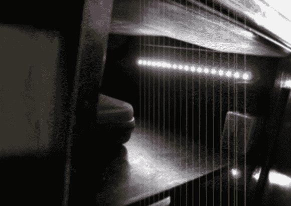

# 在书桌内添加任务照明

> 原文：<https://hackaday.com/2012/12/21/adding-task-lighting-inside-a-desk/>

[Mahesh Venkitachalam]想要照亮他书桌的黑暗角落。如果你看不到里面的任何东西，那么这些存储空间有什么用呢？他的解决方案是[添加 LED 灯条，当门打开时，LED 灯条会自动打开](http://makeprojects.com/Project/Automatic+Lights+for+Desk+Interior/3034/1#.UNSgc2I1EWn)。

设计很简单。2N2222 NPN 晶体管负责连接安装在每个搁板下的 LED 灯条的接地轨。晶体管基极通过上拉电阻保持高电平。但是当门关闭时，簧片开关总是将底座接地。打开门会移除保持簧片开关关闭的磁铁。这允许电流从上拉电阻流向基极，将接地轨连接到 LED 灯条并打开它们。休息之后你可以看视频演示。

我们在设计中看到的一个问题是它们由 9V 电池驱动。在很长一段时间内，上拉电阻会耗尽电池。你可以在五金店或电子商店买到额定电流为 500 毫安的磁簧开关。如果你能把 LED 灯条放在下面，并且当磁铁存在时有一个灯条是打开的，那么当灯不被使用时，你将会有零功率消耗。

[https://www.youtube.com/embed/64n8YgJmMOY?version=3&rel=1&showsearch=0&showinfo=1&iv_load_policy=1&fs=1&hl=en-US&autohide=2&wmode=transparent](https://www.youtube.com/embed/64n8YgJmMOY?version=3&rel=1&showsearch=0&showinfo=1&iv_load_policy=1&fs=1&hl=en-US&autohide=2&wmode=transparent)

[via [Flickr](http://www.flickr.com/photos/tat-tvam-asi/8294193524/in/pool-69453349@N00)