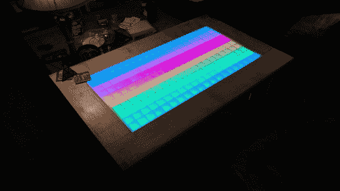

# 可寻址 RGB LED 茶几

> 原文：<https://hackaday.com/2013/12/19/addressable-rgb-led-coffee-table/>

[Alexander]刚刚对他的可寻址 RGB LED 咖啡桌进行了最后的润色，它看起来太棒了！

利用他在威斯康辛州麦迪逊市 67 区的本地黑客空间，他学会了如何使用木工设备用漂亮的卷曲枫木板材制作桌子。

接下来，他购买了两块 4 英尺×8 英尺的 2.8 毫米竹胶合板——甚至不得不租一辆 U 型拖车将它运回太空。说到对一个项目的奉献！之前也从未使用过激光切割机，[Alexander]很快就厌倦了这种蹩脚的激光界面软件，所以他在记事本上手写了 SVG 格式的图形，然后转换成 DXF 格式。这听起来像是一个相当慢的方法，但他认为它最终会更快，因为它都是直线。两个小时的激光时间后，他有了一系列的开槽条来创建 led 的网格。

为了真正照亮他的项目，他使用了他从易贝订购的漂亮的大 12 毫米 RGB LEDs 它们有四股，每股 50 个，这使得布线非常容易。一个结实的 5V 12A PSU 提供能量，一个 Arduino 负责寻址。他甚至把主电源线藏在了一条腿上！

这是一个华丽的建筑，对于第一次使用大多数设备的人来说，这是一个令人印象深刻的项目。休息后的短视频里自己看吧。

[https://www.youtube.com/embed/FnnTcYtlnAI?version=3&rel=1&showsearch=0&showinfo=1&iv_load_policy=1&fs=1&hl=en-US&autohide=2&wmode=transparent](https://www.youtube.com/embed/FnnTcYtlnAI?version=3&rel=1&showsearch=0&showinfo=1&iv_load_policy=1&fs=1&hl=en-US&autohide=2&wmode=transparent)