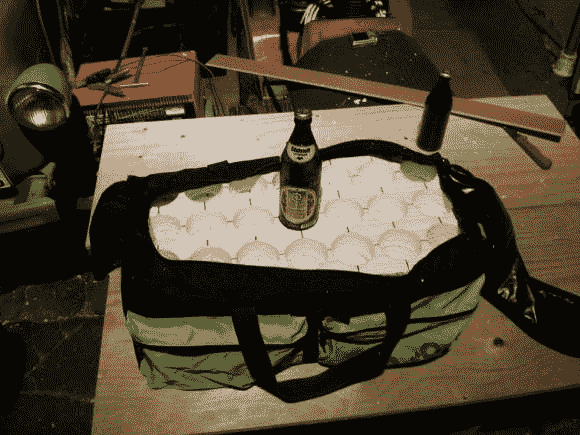

# 先进的啤酒运输船，或者如何把啤酒带上飞机

> 原文：<https://hackaday.com/2014/02/23/advanced-beer-carrier-or-how-to-get-beer-onto-a-plane/>

[Badmonky]正面临着生活危机。当他住在新泽西州的普林斯顿时，怎么能享受到在他的家乡很难找到的德国啤酒呢？当然，如果你尝试的话，你可以找到很多好的进口货，但是那可能会付出很高的代价。另外，鲜为人知的啤酒在美国是完全买不到的。当然，解决办法是每次回家后自己把它们进口。他只是需要一种方法在飞机上尽可能多地弄到啤酒。

我们可以带着几箱冰镇的走在过道上，但是让我们诚实地说。如今，安检甚至不会让你带着一瓶水上飞机，更别说是高个子了。[Badmonky]组装了这个定制的载体，这样它就可以作为行李托运，同时保护泡沫善良。要考虑的两个限制因素是尺寸和重量。他从后者开始，计算出 24 瓶仍低于他的 50 磅限制。他从那里挑选了一个运动包，拿起用孔锯打孔的泡沫片。唉，大小的限制迫使他留下三个(现在空了？)后面的船只。

瓶子上下颠倒，平安无事地进行了国际航行。回想起来，他可能会选择一个滚轮包，因为在经过机场和乘坐公共交通工具回家后，这个东西会很难扛在肩上。

我们心中真正的问题是:他为什么不检查一桶？