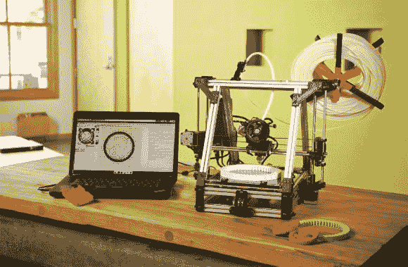
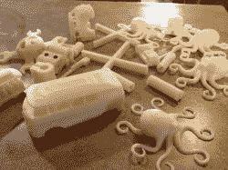
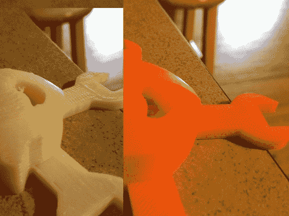
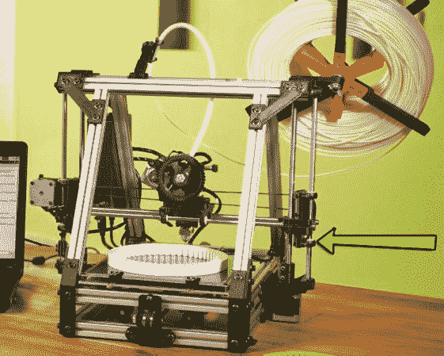
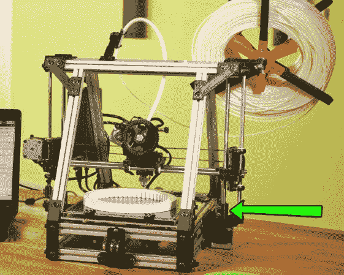
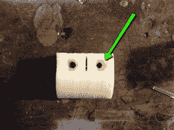
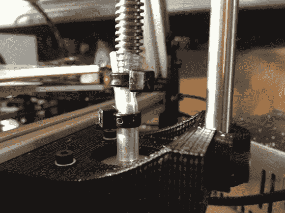
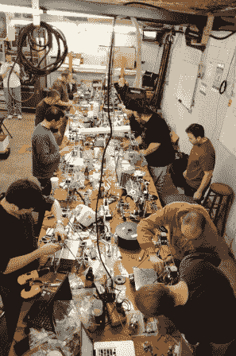

# 3d 打印的冒险:我们使用 LulzBot AO-100 的第一周

> 原文：<https://hackaday.com/2013/02/09/adventures-in-3d-printing-our-first-week-with-the-lulzbot-ao-100/>

最近，我们收购了一台 [LulzBot AO-100](http://www.lulzbot.com/?q=products/ao-101-3d-printer) 。它是免费送给我们的。在拥有它大约一个星期后，我想通了足够多的事情，我觉得我终于可以分享我的想法、印象和经历了。我会对机器完全诚实。这是给我们的，这太棒了，但是，嘿，我必须与读者分享真实的信息。

当我们第一次开始寻找打印机时，我们决定不要从头开始制造。虽然这最初看起来可能与“一天黑一次”背道而驰，但这是有原因的。我不能从零开始构建我使用的每一个工具。我心中有一些项目可能会受益于 3d 打印机，我想在这些项目上工作。这意味着我在寻找一个预组装的单位。许多人想要一篇关于如何使用 reprap 的文章，所以我们也开始考虑基于 reprap 的工具包。

当 LulzBot 与我们联系时，我起初持怀疑态度。我的意思是，这个名字是机器人。这是网络巨魔吗？这与黑客组织 [Lulzsec](http://en.wikipedia.org/wiki/LulzSec) 有什么联系吗？他们真的把他们的打印机命名为 LulzBot 吗？事实证明，它们是合法的。不仅如此，我们以前见过他们，他们也是 AlephObjects，[他们发来了墙上打印机工作的视频](http://hackaday.com/2012/08/23/help-us-decide-if-this-huge-reprap-array-is-the-largest-fleet-to-date/)。他们为什么把它命名为 LulzBot？答案基本上是，为了 lulz。值得注意的是，[Jeff]长期以来一直是自由软件的强烈支持者，Lulzbot 是完全开放和可共享的。您可以立即访问网站，下载器件列表以及所有源代码和配置。

当你进一步阅读时，请记住他们寄给我的模型不是他们最新的。他们甚至不再卖这种型号了。从技术上来说，大致落后 2 代。

LulzBot 分两批到达。一个是打印机本身，另一个是一个装满备件的盒子，包括 15 磅用于打印的灯丝和一套完整且相当广泛的工具。这台打印机包装得非常好。他们有某种符合打印机形状的膨胀泡沫，并紧紧地抓住它。它有一张检验单，包括零件的清单，和一个样本打印，我认为是这台机器的。这是一个不错的小接触。

我把它拿出来，放在我的厨房柜台上，随手翻到手册中解释拆包和安装过程的部分。它实际上只涉及到移除一些用于运输的东西，并组装灯丝线轴支架。

在这一点上，我已经注意到连接框架的大部分零件都是 3d 打印的。这并不新鲜，我们已经见过无数次了，但 3d 打印的多件式可调灯丝支架突然让我非常兴奋。这是一个完整的工具，是由一台和我面前的一模一样的机器制造的。不仅仅是一个零件，是一个有活动部件的完整工具。组装完成后，我安装了 Arduino、Gslicer 和 PrintrFace 的必备软件。

快速组装后，剩下的工作就是调平底座，设置 z-home，并在挤出机中装入新的长丝。装灯丝很容易。所有需要做的就是我松开几个螺栓，把临时的拔出来，然后把新的一端塞进去。

设置 Z 高度很简单。点击 Z-home 按钮，观察喷嘴下降。z 轴的一侧有一个粗大的指旋螺钉，z 停止开关落下时会碰到它。稍微拧一下就可以精确地调整喷嘴的初始位置。手册上有图片显示大概应该有多近。

接下来，我必须把床弄平。我下载了他们网站上一个可供下载的文件。该文件在整个构建表面上打印一个正方形和一个大图案。这让你可以看到床的位置可能是几分之一毫米低或高。通过角上的四个小螺栓进行调节。

然后我开始打印东西。

在这一点上，我可以停止！就这些了。尽可能简单。

然而，如果你记得，这不是最新的模型。为了获得更好的质量，我可以对它进行升级。我不能不管它，我必须开始处理它。

我选择打印一些我之前在 Makerbot Replicator 上打印过的项目，以便进行比较。值得注意的是，LulzBot 配备了. 5 毫米的喷嘴，我使用的复制器配备了. 35 毫米的喷嘴(我认为，可能是. 4 毫米)。

最初的照片很不错。尤其是当我把我的 Z 高度降低到它应该达到的高度。[Jeff]给了 be 一个稍微新一点的配置文件，这也带来了很大的不同。

这是一段展示早期指纹的延时录像。你会注意到我没有把我的高度设置得足够低，这导致了一个触手弹出。这没什么大不了的，一个小调整就解决了。

[https://www.youtube.com/embed/8FYitYeVyMA?version=3&rel=1&showsearch=0&showinfo=1&iv_load_policy=1&fs=1&hl=en-US&autohide=2&wmode=transparent](https://www.youtube.com/embed/8FYitYeVyMA?version=3&rel=1&showsearch=0&showinfo=1&iv_load_policy=1&fs=1&hl=en-US&autohide=2&wmode=transparent)

实际上，我对自己在照片中发现的一些特殊波动感到有点沮丧。我的 z 轴似乎需要不断调整，每次都不能可靠地回到原点。我最终发现这只是 z 轴导轨上的几个松动的螺丝，我的问题是当我把它从盒子里拿出来时，我应该在视觉检查中注意到的。

**x 轴托架安装下部件升级。**

[Jeff]建议我下载 x 轴支架的下半部分。这一升级提供了更多的稳定性，并应减少抖动。我下载了然后打印出来。为了安装它，我必须从 z 轴电机上拆下大的 Acme 螺丝。这种升级在下一步中被放回库存。

**z 轴-acme-适配器升级。**

我很快对 z 轴 acme 适配器感到恼火。他们有用于螺栓的凹孔，但这些孔不是螺栓的精确尺寸，所以它在凹痕中自由旋转。因为它是锯齿状的，我也不能把扳手放在它上面。我最终在孔里放了强力胶，一旦干了，就给了螺母足够的摩擦力来保持不动。在这个过程中，当我解释我对[Jeff]的失望时，他指出我可以打印更新更好的，就像他们在新模型中使用的那样。我应该指出，我在其他地方也看到过这种情况，不仅仅是 lulzbot。对于小坚果来说，这是个坏主意。平面太小，抓不住。塑料太有弹性了。

我不得不在打印机上把这些*打回去，然后打印新的。我又一次纠结于螺母会自由旋转的事实，所以我无法把它拧得足够紧。因为太松了，马达在支架里一直旋转。不仅如此，我还注意到新的花哨的 x-carriage 支架一直向下悬挂，足以干扰 z 轴-acme 适配器。我没有这个坐骑应该保持的线性轴承，所以我最后只是把库存的放回去。*

在检查新的 z 适配器时，我注意到它们有相同的凹进螺母区域。这里的理论是，螺母将紧密配合，不会转动，在实践中，我发现如果它们足够小，它们会转动。较大的没有这个问题。为了解决这个问题，我只是把螺栓的头部放在另一边的表面上留下螺母的部分。由于螺栓有一个内六角头，这工作得很好。这是一个非常恼人的问题，却有一个简单得可笑的解决方案。

The problem holes. They look like they would hold the nut, but slips.

the easy solution

新的适配器更好，底部有一个键控孔，非常适合电机的转子。我把所有的东西都装回去，尽我所能拧紧，装上较小的 0.35 毫米喷嘴，开始打印。角落更紧凑，细节更精细，但我也有这种新的和恼人的 wavy。

more detail, but now wavy

stock printing

经过一些快速的研究，我发现我对 repraps 的缺乏经验把我引向了错误的方向。似乎 z 轴电机/acme 螺丝并不都应该尽可能地坚固和紧密安装。他们应该能够稍微扭动一下，这样安装角度的轻微缺陷，或者螺钉的平直度就不会有足够的力来推动整个车厢偏离轨道几分之一毫米。

我松开了新的适配器。这是相当容易的，因为我已经扭转了拧紧它们的螺栓的安装。我把马达和 acme 螺丝拧出来，这样它们就刚好在适配器里面，然后把它拧紧。这允许有更多的回旋余地。我的印刷提高了！

IRC 的#reprap 频道上的一些非常好的人建议我尝试用橡胶管作为耦合器。它有足够的挤压弹性来消除大部分不一致。果然，几块橡胶管工作正常！

在这一点上，我有细节和质量。它正在嗡嗡地打印一些有趣的东西。

**一个容易解决的大问题** 

当我儿子在 thingiverse 上看到所有与齿轮相关的文件时，他非常兴奋。自然就下载了一个简单的打印出来了。我选择了这个简单的[行星齿轮组](http://www.thingiverse.com/thing:16897)。不幸的是，尽管它看起来很好，但齿轮不适合外环。一切都有点太大了。我可以把它推进去，但是压力太大了，它转不动了。然后我试了一个[齿轮心](http://www.thingiverse.com/thing:24675)，我碰巧有一个来自另一个打印机的例子。我可以把它组装起来，但是出了点问题，齿轮不能正常转动。我很沮丧，因为这意味着我打印的任何非常精确的东西都无法工作。

我联系了[Jeff]，他把同样的文件拿到他们的机器上打印了出来。他说文件对他们有用。在[Jeff]发现我加载了错误的配置文件之前，我们反复讨论了好一会儿。即使我有 AO-100，我也需要 AO-101 的配置文件，这些文件对于最新版本的 slicer 是正确的。

在那次更新之后，我的零件就像它们应该的那样啮合了！我挺开心的。

**吓得不敢说话**

在与一些人交谈时，我发现 repraps 的最大问题是，你必须自己构建它们。当你看到他们实现的细节，然后考虑到你可能从来没有建造过如此精确的东西，这可能是令人生畏的。克服这种恐惧一个很好的方法就是去参加一个建筑聚会。有些人会举办聚会，让一群人聚在一起，一起建立自己的名声。当我问[【Sonny】谁办这些派对](http://os1r1s.com/?page_id=868)时，他说每个人都带着不到 1000 美元的功能性 reprap 回家。你从整个团队中获得帮助和专业知识。黑客空间有时也会组织这些活动，所以一定要找到你当地的黑客空间并询问。事实上，2 月 15 日在纳什维尔的[黑客联盟](http://hackaday.com/2012/06/07/hackerspace-intro-hacker-consortium-in-nashville-tn/)和 3 月 9 日在肯塔基州路易斯维尔的 [LvL1](http://www.lvl1.org/) 都有一个。

当然，你总是可以得到一台像我们一样预先组装好的机器。