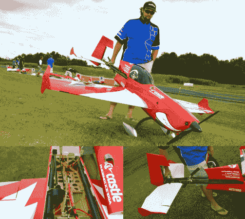

# 空气动力学？超级蜜獾不给@#*^@！

> 原文：<https://hackaday.com/2014/07/30/aerodynamics-super-honey-badger-dont-give-a/>

[炎亚纶·贝茨]是来自澳洲的专业遥控飞机飞行员。在过去的几年里，他一直在追逐一架可以无限旋转的固定翼飞机的梦想。在独立控制的机翼扰流器的一些有希望的开始之后，[炎亚纶]全力以赴，创造了超级蜜獾。超级蜜獾是一架巨型遥控飞机，有着直升机的尾巴和一个纯粹的令人敬畏的灵魂。

从为 3D 飞行设计的标准 [87”翼展 Extra 300](http://www.3dhobbyshop.com/87-Extra-300-SHP--Red_p_15169.html) 开始，【炎亚纶】开始了黑客行动。整个后机身被拆除，换上了碳纤维管。标准的 Extra 300 尾部组件完全适合管子。在缩短的机身和尾部之间，[炎亚纶]安装了一个 800 型直升机的尾桨。一个 1.25 千瓦的无刷电机驱动尾桨，而高速伺服控制螺距。

[炎亚纶]在 2013 年 HuckFest 上首次亮相，完成了一些惊人的特技飞行。尾桨让 540 [失速转弯](http://en.wikipedia.org/wiki/Stall_Turn)变得很容易——即使是飞机。平旋很容易进入，即使是从快速向前飞行！大多数(炎亚纶的)动作都无视任何命名的尝试——休息后看看视频就知道了。

可悲的是，超级蜜獾在 2014 年 5 月被摧毁，原因是碳管的结构性故障。[炎亚纶]没有受伤就离开了，而且没有放弃。他已经透露了关于一架新飞机的主要线索。

观看视频中操纵面的移动。值得注意的是，超级蜜獾没有携带陀螺仪或飞行稳定系统。飞机的每一个动作都是对(炎亚纶的)控制输入的直接反应。

[https://www.youtube.com/embed/l_ETketuqxw?version=3&rel=1&showsearch=0&showinfo=1&iv_load_policy=1&fs=1&hl=en-US&autohide=2&wmode=transparent](https://www.youtube.com/embed/l_ETketuqxw?version=3&rel=1&showsearch=0&showinfo=1&iv_load_policy=1&fs=1&hl=en-US&autohide=2&wmode=transparent)