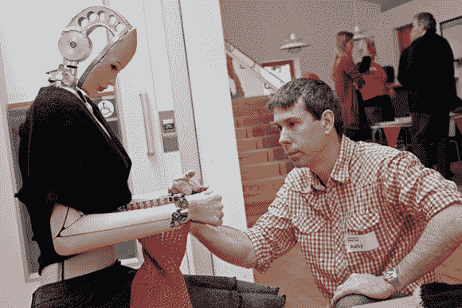

# Agnes Roboknit:一个令人毛骨悚然的机器人，它甚至拥有脸书的个人资料

> 原文：<https://hackaday.com/2014/01/27/agnes-roboknit-a-robot-so-creepy-it-even-has-a-facebook-profile/>

[Andy Noyes]是一位英国艺术家兼发明家，他最近在 2013 年英国创客节上首次展示了他的最新项目[Agnes robok nit](http://makezine.com/magazine/make-37/agnes-the-knitting-robot/)。Agnes 是一个人形机器人，会编织，会吓唬小孩子，偶尔会四处张望，好像在想为什么她的创客会让她过着如此无聊的生活。

[安迪]希望她从远处看起来像人类，但他也想在近距离观察时展示她的机械部件。她几乎完全是手工制作的——从她自制的由 DC 汽车公司驱动的齿轮，到她用真人石膏模型铸造的乳胶皮肤。他原本计划让她用真正的针编织，但在发现这有多么困难后，[安迪]选择了针织机。

他以祖母的名字 Agnes 为她命名，尽管他曾希望像 80 年代的其他经典机器人一样，给这个名字加上一个聪明的缩写(A.G.N.E.S)。休息后留下来，看看她在织布机上编织的迷人特写。这些动作出奇的简单，但同时也令人着迷。

[https://www.youtube.com/embed/eTroGtEch-E?version=3&rel=1&showsearch=0&showinfo=1&iv_load_policy=1&fs=1&hl=en-US&autohide=2&wmode=transparent](https://www.youtube.com/embed/eTroGtEch-E?version=3&rel=1&showsearch=0&showinfo=1&iv_load_policy=1&fs=1&hl=en-US&autohide=2&wmode=transparent)

如果你需要一个机器人朋友，她也有脸书的资料。