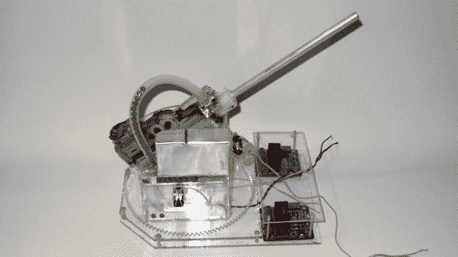

# 气枪炮塔有旋转、倾斜和自动进给功能来保持那些 BBs 飞行

> 原文：<https://hackaday.com/2013/02/15/airsoft-turret-has-turn-tilt-and-auto-feed-to-keep-those-bbs-flying/>

又一个证明你需要激光切割机的项目。这个气枪[炮塔旋转、倾斜，包括一个弹药漏斗](http://www.doityourselfgadgets.com/2013/02/airsoft-turret.html)。

所有的作品都是从丙烯酸树脂上切下来的。底座包括一个支架，通过将大型旋转齿轮夹在两层之间来保持其水平。这和倾斜机制是非常简单的。负责加载 BBs 的模块非常简洁。它使用与弹药直径相同的圆齿齿轮。一旦 BB 被提起，它就被迫向上进入供给枪的管道。休息后从演示视频中获取完整图片。

[Liquider]想知道的一件事是如何为倾斜和旋转功能提供反馈。我们想不出比使用简单的旋转编码器更简单的方法了。他希望用作驱动器的 Arduino Mega 与反射传感器的接口没有问题，丙烯酸树脂使安装这种类型的黑白编码器轮变得简单。

[https://www.youtube.com/embed/zuIIvsmHyqo?version=3&rel=1&showsearch=0&showinfo=1&iv_load_policy=1&fs=1&hl=en-US&autohide=2&wmode=transparent](https://www.youtube.com/embed/zuIIvsmHyqo?version=3&rel=1&showsearch=0&showinfo=1&iv_load_policy=1&fs=1&hl=en-US&autohide=2&wmode=transparent)