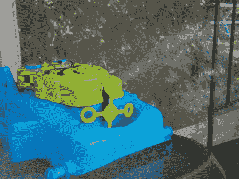

# 闹钟像[劳伦斯·韦尔克]一样叫醒你

> 原文：<https://hackaday.com/2012/05/16/alarm-clock-wakes-you-like-lawrence-welk/>

如果是一连串的泡泡，早上床边可怕的嗡嗡声可能不会那么糟糕。至少这是[威尔]所希望的。他拿了一个孩子的玩具[变成了吹泡泡闹钟](http://mad-science.wonderhowto.com/blog/wake-up-bubbles-by-making-worlds-most-gentle-alarm-clock-0135075/)。

我们猜测你不会太喜欢闹钟设置功能。这不是使用实时时钟，或任何时钟。[威尔]使用 PNP 晶体管推出了自己的光检测电路，晶体管的基极由 LDR 控制。当房间里的光线达到一定的阈值时，气泡开始从这个东西的前面流出。他通过在一个黑暗的房间里打开和关闭一盏灯来测试视频中的系统。

黎明时起床从来不是我们描述自己的方式，但这里看到的单线控制方法可以很容易地由微控制器而不是 LDR 提供。哦，对于那些不明白的人；劳伦斯·韦尔克的节目总是从满是泡泡的屏幕开始。

[https://www.youtube.com/embed/zvHPadvbk6g?version=3&rel=1&showsearch=0&showinfo=1&iv_load_policy=1&fs=1&hl=en-US&autohide=2&wmode=transparent](https://www.youtube.com/embed/zvHPadvbk6g?version=3&rel=1&showsearch=0&showinfo=1&iv_load_policy=1&fs=1&hl=en-US&autohide=2&wmode=transparent)