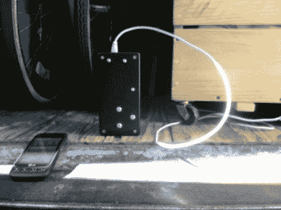

# 警报系统确保你的移动卡车不会被突袭

> 原文：<https://hackaday.com/2012/09/05/alarm-system-makes-sure-your-moving-truck-doesnt-get-raided/>

当你搬家的时候，你通常会把你所有的东西都装进一辆卡车里。如果你的整个生活将要被撕裂，这可能就是它将要发生的时候。为了防范这种威胁，蒂姆·弗林特为一辆行驶中的卡车制造了自己的报警器。如果有人打开卡车上的门，它会通过短信提醒他。希望他听到了恼人的通知声，能及时叫醒他，当场抓住他们。

这种设置很简单，不会让你在打包和装载时分心太多。[Tim]将一个接近传感器连接到一个 Arduino 板上，该板有自己的 WiFi 模块。整个东西被安置在上面看到的黑色项目箱中，接近传感器指向移动的卡车门。当门打开时，Arduino 会向 Twilio 发送一个警报，该警报被配置为向他发送短信。

警报系统不能防止有人偷了整辆卡车…那种系统是一个完全不同的项目。