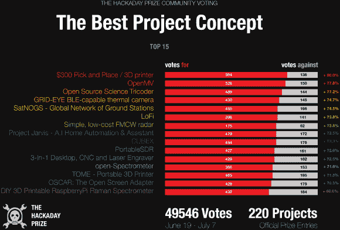

# 所有选区报告——下一轮投票现在开始

> 原文：<https://hackaday.com/2014/07/08/all-precincts-reporting-next-round-of-voting-is-now/>

查看[Alek]汇总的投票结果(点击查看更大的版本)。我们对宇航员的第一轮投票结果感到非常高兴。已经有将近 5 万张选票了，是时候开始新一轮投票了。

这是全新的一轮。您的 30 张选票已经恢复，您必须在新一轮投票中至少投票一次，才有资格参加选民抽奖。主题也变了；为那些想法[最有可能被其他项目](http://hackaday.io/prize/vote)采用的项目投票。也就是说:有没有一个核心的小聪明，经过适当的解释和模块化，将是非常可扩展的？那就投那个吧！

休息后会列出 15 位获奖者的链接；名单上的每个人都会得到一件 t 恤和一些贴纸。下一轮也是如此，但我们将改变选民彩票的奖金——它将[同样有价值和令人向往](http://hackaday.com/2014/06/26/the-hackaday-prize-vote/),但我们将把细节留到周四。请务必投票，否则可能会失去周五的彩票！

### 恭喜宇航员的第一轮获胜者！

*   [$300 取放/ 3D 打印机](http://hackaday.io/project/963)
*   [OpenMV](http://hackaday.io/project/1313)
*   [开源科学三录](http://hackaday.io/project/1395)
*   [支持栅眼 BLE 的热感摄像机](http://hackaday.io/project/1389)
*   [SatNOGS–全球地面站网络](http://hackaday.io/project/1340-SatNOGS)
*   [LoFi](http://hackaday.io/project/1552)
*   [简单、低成本的 FMCW 雷达](http://hackaday.io/project/1682)
*   贾维斯项目——人工智能家庭自动化&助理
*   [CUBEX](http://hackaday.io/project/270)
*   [便携式 DR](http://hackaday.io/project/1538)
*   [三合一桌面、数控和激光雕刻机](http://hackaday.io/project/1464)
*   [开谱仪](http://hackaday.io/project/1342)
*   [汤姆–便携式 3D 打印机](http://hackaday.io/project/1437)
*   [奥斯卡:开放式屏幕适配器](http://hackaday.io/project/369)
*   [DIY 3D 可打印 RaspberryPi 拉曼光谱仪](http://hackaday.io/project/1279)