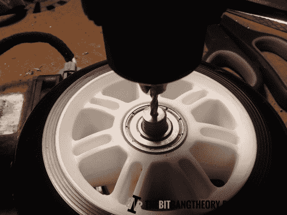

# 改变项目中使用的汽车车窗电机

> 原文：<https://hackaday.com/2013/05/16/altering-automotive-window-motors-for-use-in-your-projects/>

我们同意[马里尼奥·萨列罗]的观点，汽车电动车窗的马达为你的下一个项目提供了一个奇妙的高扭矩解决方案。如果你在你的镇上有一个你挑选的垃圾场，在你花一点时间找到并从院子里移走零件后，它们会非常便宜。但是你可能会想增加一些额外的步骤来做好准备，他在记录[他如何用轮子和旋转编码器](http://thebitbangtheory.blogspot.pt/2013/05/high-torque-encoded-dc-motors-for.html)来增强它们方面做得很好。

这个项目的一个方面真正打动了我们，那就是他的机械商店 101 风格的技巧，将马达的轴和轮子连接起来。他有一个程序可以确保你在工作时找到圆柱体的准确中心。首先在他的钻床上放一把台钳。然后，他将钻头倒置插入钻夹头，放下钻头，将虎钳夹在钻头上。松开卡盘后，钻头指向卡盘的正中心。接下来，他抓起一根螺纹杆，在钻床旋转的同时，将它放入钻头，钻出一个完全居中的孔。上图显示了他用这个机器零件作为导向，继续在电机轴上钻孔。点击上面的链接，了解他使用的其他技巧。