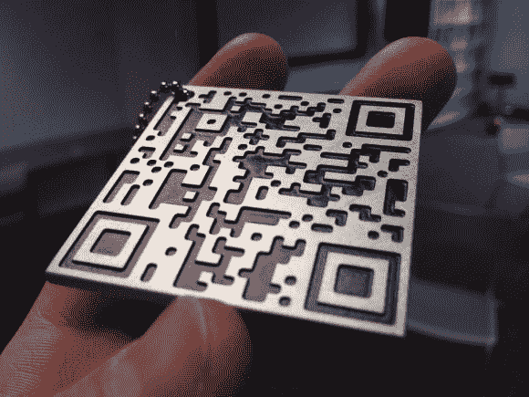

# 铝制比特币钥匙扣

> 原文：<https://hackaday.com/2013/12/16/aluminum-bitcoin-keychain/>

这里有一个很酷的方法来为你的比特币带来一个物理存在:[一个定制的 CNC 铣削二维码比特币地址！](http://imgur.com/a/dHSCB)

[ch00f]，我们在 Hack a Day 的[临时](http://hackaday.com/author/ch00f/)作家之一，刚刚完成了这个光滑的铝比特币二维码钥匙链。他首先使用一个名为 [OCLVanitygen](http://en.bitcoin.it/wiki/Vanitygen) 的程序创建了一个虚拟的比特币地址，开头是他父亲的名和姓，后面是一串随机的数字。我 t 只用了他的镭龙 HD6790 6 个小时就解决了，这相当于大约 [半万亿次猜测](http://www.reddit.com/r/DIY/comments/1swvy1/aluminum_bitcoin_address_keychain/ce26ktr) 为了找到地址 ！

然后，他用闪亮的新比特币地址，用网络生成器创建了一个二维码。【ch00f】然后在 Photoshop 中提高图像的分辨率，导入到一个名为 [CamBam](http://www.cambam.info/) 的 CNC 程序中。一台改装的 CNC Taig mill 开始用 0.049”的硬质合金端来描绘代码。总研磨时间刚刚超过 2 小时。一点黑色喷漆，一些打磨，和几层透明涂层之后，钥匙链就完成了！

【via[Reddit](http://www.reddit.com/r/DIY/comments/1swvy1/aluminum_bitcoin_address_keychain/)