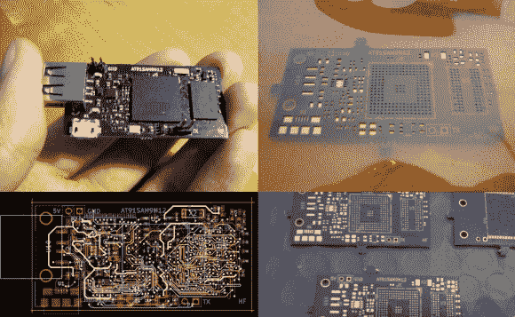

# 一台神奇的带 BGA 的 DIY 单板 ARM 计算机

> 原文：<https://hackaday.com/2014/07/11/an-amazing-diy-single-board-arm-computer-with-bga/>

通常，你会买一台单板 Linux 电脑。[Henrik]有一个更好的主意，建造他自己的基于 ARM 的单板计算机！他是怎么做到的？通过不害怕球栅阵列(BGA) ARM 处理器。

每个人都喜欢[树莓派](http://www.raspberrypi.org/)和[猎兔犬板](http://beagleboard.org/)，但是买一些你可以制作的东西有什么乐趣呢？我们有一种预感，我们的大多数读者对 BGA 芯片敬而远之，这是有充分理由的。可以说，[Henrik]文章中最重要的一点是，你可以用廉价的工具轻松焊接 BGA。 [OSH Park](https://oshpark.com/) 提供廉价的高质量 PCB， [OSH Stencils](http://www.oshstencils.com/) 提供廉价的 Stencils，任何[烤面包机](http://hackaday.com/2014/06/16/reflow-oven-controller-with-graphic-lcd/)都可以让你焊接甚至是最困难的元件。他不仅回顾了 PCB 的构建，还讨论了 bootloader、u-boot 以及如何运行 Linux。

对亨里克来说，一切都很顺利。这也是一件好事，因为我们肯定不想调试如此复杂的 PCB。你做过哪些使用 BGA 的项目？让我们知道进展如何！