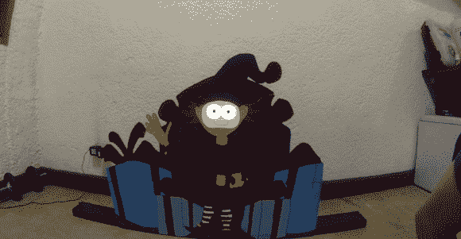

# 一个活泼的精灵

> 原文：<https://hackaday.com/2013/12/25/an-animated-elf/>

万圣节受到了装置类黑客的大量关注，但[斯蒂芬的] [正在进行的动画精灵黑客](http://www.youtube.com/watch?v=SEmq3PsnN0M)提供了一个将圣诞精神带入生活的完美例子。

[Stephen]用一块废弃的胶合板建造了背景和小精灵的身体，用手工绘制和绘画所有的东西，然后用一个简单的 2×4 作为支架固定胶合板。黑客的大部分相当简单，反映了传统 cel 动画的长期技术:非移动部分保持静止，只有移动部分需要改变。在这种情况下，[斯蒂芬]的捷径是插入一个平板电脑作为精灵的脸。

这款平板电脑是一款黑莓 PlayBook，它可以移动眼睛，并在制作嘴部动画的同时脱口而出一些与圣诞老人相关的俏皮话。[Stephen]PlayBook 的 5 分钟屏幕超时功能遇到了问题，不得不设计一个自定义应用程序来防止平板电脑在播放动画时进入睡眠模式。他的未来计划是在胶合板上钻一个洞，暴露平板电脑的光传感器，以检测何时有人走过，然后让精灵做出响应。你可以在下面的视频中看到他迄今为止的进步。

[https://www.youtube.com/embed/SEmq3PsnN0M?version=3&rel=1&showsearch=0&showinfo=1&iv_load_policy=1&fs=1&hl=en-US&autohide=2&wmode=transparent](https://www.youtube.com/embed/SEmq3PsnN0M?version=3&rel=1&showsearch=0&showinfo=1&iv_load_policy=1&fs=1&hl=en-US&autohide=2&wmode=transparent)