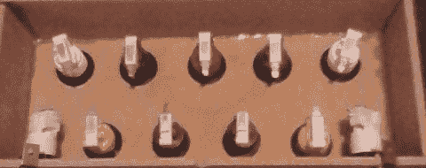

# 最初的游戏机的街机控制器

> 原文：<https://hackaday.com/2013/08/21/an-arcade-controller-for-the-original-playstation/>

[Kevin]刚刚为一个住在他公寓里的人完成了一个项目。这位居民*喜欢*游戏 Pop ' n Music——这是一款为最初的 Playstation 和 PS2 设计的吉他英雄游戏，它使用九个彩色按钮而不是指板上的五个按钮。他最初的想法是将几个街机按钮连接到 Playstation 控制器上，但这个计划失败了，迫使[凯文]独自一人去[弄清楚 PSX 的公交车。](http://kevincuzner.com/2013/08/17/pop-n-music-controller-avr-style/)

最初的代码是从简单地用 AVR 对 PSX 控制器接口进行位碰撞开始的。这有一些问题，即速度，迫使[Kevin]转向汇编编程，以充分发挥微控制器的性能。

组装路线也失败了，丢弃了一些事务再看这个问题，[Kevin]意识到 PSX 控制器总线看起来有点像 SPI 总线。需要做一些改变——颠倒位的顺序，并使用 MISO 线来驱动晶体管——但这种方法在第一次尝试时几乎完美。

现在，[凯文]的室友为他最喜欢的游戏定制了一个 Playstation 控制器。当然，所有的代码都在 github 上，以满足你所有的 PSX 控制器仿真需求，但一定要看看[这个完全不相关的流行音乐视频](http://www.youtube.com/watch?v=yY21hkUef6E)，它来自一个迫切需要钢琴的人。