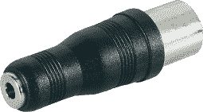

# 基于 ARM 的 DSP 模拟合成器

> 原文：<https://hackaday.com/2014/06/14/an-arm-based-dsp-modelling-synth/>

Moog，Oberheim，Sequential Circuits 和 Doepfer 的更现代版本的伟大模拟合成器因其声音，充满旋钮和插头的架子的绝对威严，当然还有价格而重新调整。模拟合成器建造起来非常昂贵，而且考虑到爱好者甚至对数字控制振荡器嗤之以鼻，需要大量的工程来建造。[【Jan】的 DSP-G1](https://www.indiegogo.com/projects/the-dsp-g1-analog-modeling-synthesizer) 不像那些模拟合成器——它使用微控制器和 DSP 来产生它的哔哔声和哔哔声。然而，它非常便宜，听起来足够接近真实的东西，它可以很容易地在几个 euroracks 和 CV 键盘之间找到一个家。

DSP-G1 的核心是恩智浦的一款微型模拟合成器，内置 15 个具有正弦、三角波、脉冲和 Saw 输出的数字控制振荡器、一个低频振荡器、两个包络滤波器和一个低通滤波器，或者类似于 70 年代的 MiniMoog 或其他老式合成器。由于这基本上是恩智浦 LPC-810 上的一个合成器，[Jan]将其封装在一个类似于 MIDI 到 3.5 毫米电缆适配器的东西中:将 MIDI 键盘插入一端，将放大器插入另一端，你就有了一个比 [MIDI 吸血鬼](http://wiki.openmusiclabs.com/wiki/MidiVamp1)更小的合成器，这是一个已经小得不可能的音乐创作工具。

[Jan]在他的 indiegogo 活动中有更多版本的他的小 DSP 设备，具有不同数量的旋钮[。不过，如果你已经有了一个带几个旋钮的 MIDI 键盘来处理所需的 CC 信息，DSP-Gplug 就是这场秀的明星。下面是视频和声音演示。](https://www.indiegogo.com/projects/the-dsp-g1-analog-modeling-synthesizer)

[https://www.youtube.com/embed/w-IUmPD-LuI?version=3&rel=1&showsearch=0&showinfo=1&iv_load_policy=1&fs=1&hl=en-US&autohide=2&wmode=transparent](https://www.youtube.com/embed/w-IUmPD-LuI?version=3&rel=1&showsearch=0&showinfo=1&iv_load_policy=1&fs=1&hl=en-US&autohide=2&wmode=transparent)

[https://www.youtube.com/embed/dLucvhlYfVU?version=3&rel=1&showsearch=0&showinfo=1&iv_load_policy=1&fs=1&hl=en-US&autohide=2&wmode=transparent](https://www.youtube.com/embed/dLucvhlYfVU?version=3&rel=1&showsearch=0&showinfo=1&iv_load_policy=1&fs=1&hl=en-US&autohide=2&wmode=transparent)

[https://w.soundcloud.com/player/?url=https%3A%2F%2Fsoundcloud.com%2Fdspsynth%2Fdsparp&width=false&height=false&auto_play=false&hide_related=false&visual=false&show_comments=false&color=false&show_user=false&show_reposts=false](https://w.soundcloud.com/player/?url=https%3A%2F%2Fsoundcloud.com%2Fdspsynth%2Fdsparp&width=false&height=false&auto_play=false&hide_related=false&visual=false&show_comments=false&color=false&show_user=false&show_reposts=false) [https://w.soundcloud.com/player/?url=https%3A%2F%2Fsoundcloud.com%2Fdspsynth%2Fsamplenhold&width=false&height=false&auto_play=false&hide_related=false&visual=false&show_comments=false&color=false&show_user=false&show_reposts=false](https://w.soundcloud.com/player/?url=https%3A%2F%2Fsoundcloud.com%2Fdspsynth%2Fsamplenhold&width=false&height=false&auto_play=false&hide_related=false&visual=false&show_comments=false&color=false&show_user=false&show_reposts=false) [https://w.soundcloud.com/player/?url=https%3A%2F%2Fsoundcloud.com%2Fdspsynth%2Fsinglesaw&width=false&height=false&auto_play=false&hide_related=false&visual=false&show_comments=false&color=false&show_user=false&show_reposts=false](https://w.soundcloud.com/player/?url=https%3A%2F%2Fsoundcloud.com%2Fdspsynth%2Fsinglesaw&width=false&height=false&auto_play=false&hide_related=false&visual=false&show_comments=false&color=false&show_user=false&show_reposts=false)