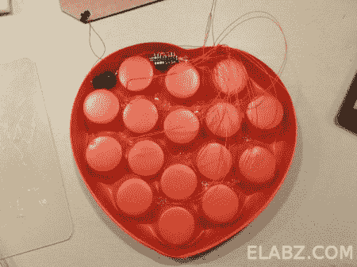

# 一个小插曲让 5 月 13 日更加明亮

> 原文：<https://hackaday.com/2012/05/03/an-attiny13-makes-may-13th-brighter/>

当去商店买那些你总是在~~情人节~~母亲节送给母亲的巧克力时，为什么不用一些 led 灯给它们增添一点情趣呢？[Dmitry]展示了你如何[轻松地给包装](http://elabz.com/pimp-your-chocolates-with-arduino-ide-and-attiny13/)添加一些闪光灯，而无需真正修改它。他使用的 ATtiny13 只有 5 个 I/O 引脚，因此他必须重复使用 led 才能使所有 10 个引脚正常工作。结果很快就会出来，可能会让妈妈知道你真的在乎她。

[via [HackedGadgets](http://hackedgadgets.com/2012/05/03/hacked-chocolate-box-has-blinking-leds-controlled-by-an-attiny13/)