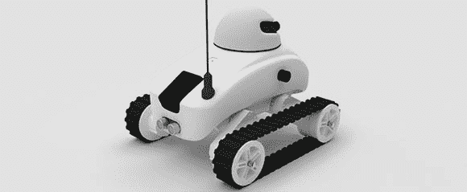

# 一个令人敬畏的，未来的，多合一的机器人底盘

> 原文：<https://hackaday.com/2013/02/15/an-awesome-futuristic-all-in-one-robot-chassis/>

不管我们在电子学上发现了多少进步，我们总是对机器人底盘的缺乏进步感到惊讶。当然，制造一个看起来很酷的有能力的机器人应该是一项简单的任务，但除了 [Veter 项目团队](http://veterobot.com/index.html)，似乎没有其他人在推进机器人力学的发展。

在之前，我们已经看过 Veter 团队的机器人底盘和[硬件，这个新版本带来了更多的东西。而摄像机。GPS、指南针和超声波传感器与之前的版本相同，有一个受[巴斯蒂安·特龙]的](http://hackaday.com/2011/11/14/theres-a-lot-packed-into-this-beagleboard-controlled-rover/)[自动驾驶汽车类别](https://www.udacity.com/course/cs373)启发的[更多软件](https://github.com/veter-team/)来使这个版本更有能力。

虽然 Veter 团队使用 Beagleboard 作为他们的车载计算机，但应该可以将硬件更换为更经济的 Raspberry Pi。即使到那时，它也不会是一个便宜的构建，但我们怀疑你会找到一个更好的机器人平台。