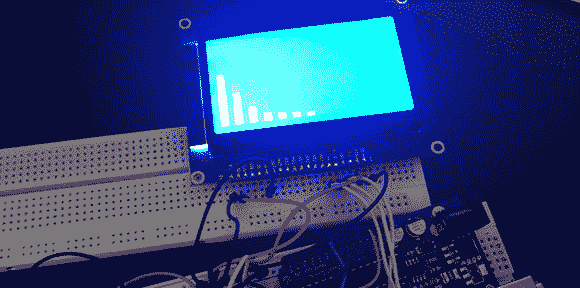

# 踏板的均衡器显示

> 原文：<https://hackaday.com/2013/04/02/an-eq-display-for-a-pedal-board/>

有很多鼓捣音乐的人在电子行业起家。然而令人惊讶的是，我们没有看到很多提交给我们的 tip line 的内容，包括电贝司的升压电路，重新布线的吉他电子设备，甚至更复杂的效果踏板。然而，[死鸟]却反其道而行之，推出了一款 [EQ 显示器踏脚盒](http://deadbird.fr/index.php?p=671)，正好安装在他的踏板上。

[Deadbird]的构建不是一个可以改变不同频段音量的图形均衡器；相反，他使用 MSGEQ7 芯片来监听他的吉他产生的信号，并在 128×64 图形背光显示器上显示出来。

整个项目是在一个带有 Arduino 的试验板上完成的。在他让所有组件都工作起来之后——一个开关踏板的瞬时开关，1/4”插孔用于输入和输出，以及一个电源——[dead bird]拿了一个 Arduino 原型盾，让一切变得更加永久。现在，他的板上有了一个吸引人的踏板，显示了来自他的吉他的七个整齐的乐队的信号。