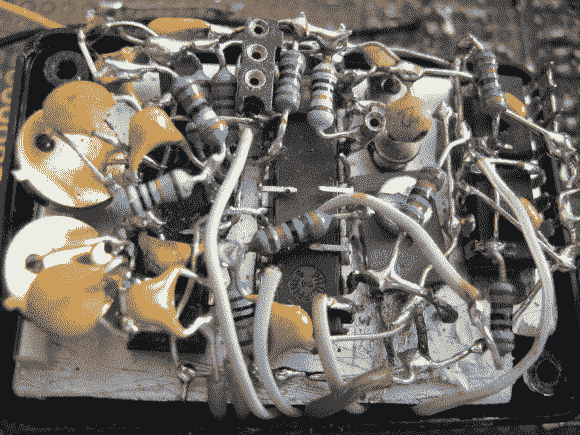

# 测试放射性衰变随时间变化的实验

> 原文：<https://hackaday.com/2014/05/19/an-experiment-to-test-radioactive-decay-varying-over-time/>

这里有一个假设:放射性衰变随时间变化，可能以一年为周期。[Panteltje] [决定测试这个假设](http://panteltje.com/panteltje/tri_pic/)，到目前为止有两年的数据可以梳理。

用光电倍增管可以很容易地检测到放射性衰变，但这些管对磁场和宇宙射线很敏感，它们可以轻易地穿过任何屏蔽[Pantelje]能想到的东西。相反，这种装置中的辐射是用简单的光电探测器检测的，直接压在充满氚的玻璃安瓿上，这是一种用于鱼饵、表盘和指南针的常见照明解决方案。

实验装置记录光电探测器、温度传感器和基准电压源，每小时将所有数据记录到 EEPROM 中一次。所有重要的电子设备都被装入一个散热、绝缘、避光的盒子中，而控制电子设备则位于一个更大的板上，带有备用电池、警报、指示灯和 RS232 连接。

一年后，【Pantelje】记录数据，将实验重新设定为另一年。现在有两年的数据可供任何人分析。当然，放射性衰变在几年内发生变化的证据将会颠覆几乎所有的科学学科，所以至少[Panteltje]在氚光的输出与预期半衰期之间有很好的记录。