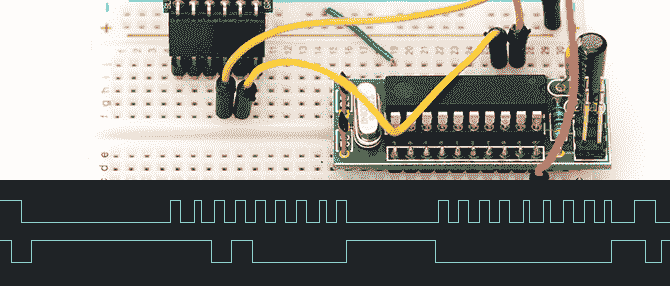

# 一种简易的 ATtiny2313 逻辑分析仪

> 原文：<https://hackaday.com/2013/09/27/an-improvised-attiny2313-logic-analyzer/>

在试图让 PS/2 接口工作而碰壁之后，[Joonas]决定他需要一个专用的逻辑分析仪。他不需要任何花哨的东西；向串行端口写入位就可以了。他想出了一个非常非常简单的基于 ATtiny2313 的逻辑分析仪,可以以 50+ kHz 的频率捕获，对于 PS/2 端口来说绰绰有余。

构建[Joonas']的硬件是一个简单的 ATtiny2313 试验板适配器，一个[FTDI 朋友](http://www.adafruit.com/products/284)，除此之外别无其他。2313 在芯片的一侧有八个输入端口，使得将正确的逻辑线路连接到正确的端口变得轻而易举。

每条逻辑线上的高点和低点通过 FTDI 芯片被发送到计算机，转换成 OLS 格式，并通过管道进入 [Open Sniffer](http://ols.lxtreme.nl/) 以制作一些精美的图表。

[Joonas]能够用他的逻辑嗅探器捕获 PS/2 信号，所以我们可以称这个项目是成功的。然而，有几个问题使这个项目变得有点麻烦:没有简单的方法将串行转储转换为二进制文件，Putty 不允许抑制到终端的输出，以及超过 115.2 kbps 的 Mac 串行端口不能自然工作。尽管如此，这个项目完成了它的工作，我们不能要求更多了。

[via [危险原型](http://dangerousprototypes.com/2013/09/24/simple-50-khz-logic-analysis-with-attiny2313-and-ftdi-friend/)