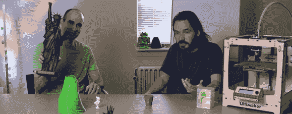

# 采访 Ultimaker 的[大卫]

> 原文：<https://hackaday.com/2013/06/20/an-interview-with-david-of-ulitimaker/>

在采访了 Slic3r 的创造者和 Shapeways 的 T2 人之后，安德鲁带着他在 3D 打印机录像方面的冒险和对终极创造者的大卫·布拉姆的采访再次回来

大约一年前，【大卫】观察了 3D 打印机控制和[复制器 G](http://replicat.org/) 的艺术状态。而 Replicator G 与 [Pronterface](http://reprap.org/wiki/Pronterface) 和 [Repetier-Host](http://reprap.org/wiki/Repetier-Host) 一起将 3D 模型转换为 g 代码文件，并在打印机将塑料挤出到床上时控制打印机。[David]认为这些 RepRap 主机程序的当前状态充其量只能算是简单的，当然对于任何家庭制造商来说都不是最好的用户体验。这让他创建了 Cura T7，这是一款为 Ultimaker 设计的非常巧妙且经过大幅改进的主机软件。

Cura 不仅仅是一个已经存在的切片器引擎的前端；[大卫]创造了自己的切片算法。STL 文件转换成 g 代码，比 skeinforge 快多了。skeinforge 可能需要一个小时来切割一个复杂的模型，而 Cura 只需几分钟就能完成同样的工作。

Cura 中还有很多很酷的功能:在发送到打印机之前，你可以旋转任何部分，也可以直接从你的《我的世界》世界中提取体素，然后发送到你的打印机。非常非常酷的东西，如果你正在运行一个 Ultimaker 或任何其他 RepRap，你可能想看看它。

[https://www.youtube.com/embed/yMAIsGV-OuA?version=3&rel=1&showsearch=0&showinfo=1&iv_load_policy=1&fs=1&hl=en-US&autohide=2&wmode=transparent](https://www.youtube.com/embed/yMAIsGV-OuA?version=3&rel=1&showsearch=0&showinfo=1&iv_load_policy=1&fs=1&hl=en-US&autohide=2&wmode=transparent)