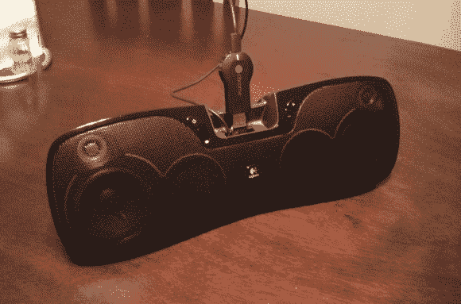

# 转换成 Chromecast 扬声器的 IPod 基座

> 原文：<https://hackaday.com/2014/08/26/an-ipod-dock-converted-into-chromecast-speakers/>

[easybakejake]想出了一种方法来融合 iPod 扬声器基座和无线 Chromecast 接收器。他的方法利用了一个经过修改的 HDMI 转 VGA 适配器。从表面上看，Google Play、Pandora 和 Music All Access 等应用程序似乎可以通过这款设备进行流媒体播放。

在研究这个音乐黑客的功能时，这个项目确实出现了一些问题。首先，自从这个提示通过 Reddit 帖子传到我们这里以来，几乎没有任何文件。另一个不便之处是支持不同的显示器尺寸。[easybakejake]在那篇帖子的评论中证实，他遇到了一个输入不起作用的错误；可能是由于分辨率问题。最终，他让它运转起来，并把这个装置命名为音乐盒。现在把它贴在 roomba 上，让它去参加 DJ 聚会(就像休息后的这个公园和娱乐小品):

[https://www.youtube.com/embed/pXhsUPtsiLU?version=3&rel=1&showsearch=0&showinfo=1&iv_load_policy=1&fs=1&hl=en-US&autohide=2&wmode=transparent](https://www.youtube.com/embed/pXhsUPtsiLU?version=3&rel=1&showsearch=0&showinfo=1&iv_load_policy=1&fs=1&hl=en-US&autohide=2&wmode=transparent)