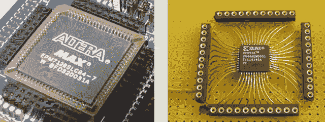

# FPGA 和 CPLD 开发在线课程

> 原文：<https://hackaday.com/2014/06/27/an-online-course-for-fpga-and-cpld-development/>

Reddit 大学有一门课程[学习所有关于 FPGAs 和 CPLDs 的知识](http://ureddit.com/class/106959/)。这只是对数字逻辑的介绍，但是有一个能够用逻辑芯片构建 [CPLD 电机控制板](http://hackaday.com/2012/08/02/cpld-motor-control/)和[显卡的老师，你一定会学到一些东西。](http://hackaday.com/2011/10/06/a-masochistic-video-card/)

本在线课程使用的开发板是 Altera EMP3032 CPLD，方便地包含在本课程使用的[FPGA 和 CPLD 套件简介](http://gadgetory.com/index.php?route=product/product&path=66&product_id=126)中。无论从哪方面来看，这都不是一个强大的设备；它只有 32 个宏单元和大约 600 个可用门。你不会用这个东西来设计 CPU，但是你将能够掌握用代码设计逻辑的概念。

未来的课程包括构建二进制计数器、PWM 控制的 led 和手持 LED POV 设备。无论如何，这都是了解可编程逻辑实际工作原理的好方法，也是进入 FPGAs 和 CPLDs 世界的一种相当便宜的方式。下面是介绍视频。

[https://www.youtube.com/embed/KUWbqaOuzOw?version=3&rel=1&showsearch=0&showinfo=1&iv_load_policy=1&fs=1&hl=en-US&autohide=2&wmode=transparent](https://www.youtube.com/embed/KUWbqaOuzOw?version=3&rel=1&showsearch=0&showinfo=1&iv_load_policy=1&fs=1&hl=en-US&autohide=2&wmode=transparent)