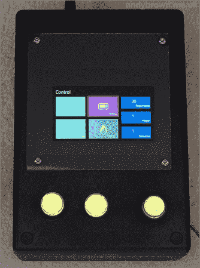

# 带 LCD 的开源 Cortex-M0 卤素回流焊炉控制器

> 原文：<https://hackaday.com/2014/05/13/an-open-source-cortex-m0-halogen-reflow-oven-controller-with-lcd/>

自制回流焊炉是一种一次快速焊接多个原型的廉价方式。[Andy]可能刚刚构建了迄今为止我们在 Hackaday 上展示的最好的一个。在他的项目中，选择了 25 1300W 升卤素灯炉，因为它成本低，加热时间快，后者需要遵循典型的回流曲线上升阶段。

为了控制交流电源[Andy]首先在 ebay 上购买了一个中国 Fotek 固态继电器(SSR)，在阅读了互联网上的相关报道后，很快被一个美国固态继电器取代。然后，他犯了同样的“错误”,从同一网站购买了典型的 MAX6675 热电偶数字转换器，因为他花了很多时间来理解 IC 有缺陷时为什么测量是错误的。他的最终产品是基于他之前对其进行逆向工程的 640×360 TFT LCD、M0 皮层 STM32F051C8T7、SPI 闪光灯、一些电源调节器和按钮。[固件](https://github.com/andysworkshop/awreflow)是用 C++编写的，我们将让读者访问【安迪】的页面，看看他的烤箱表现如何。