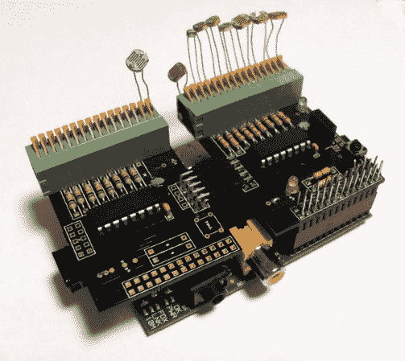

# Raspberry Pi 的模拟输入扩展板

> 原文：<https://hackaday.com/2013/03/22/analog-input-expansion-boards-for-raspberry-pi/>

[肯·奥尔森]需要一堆模拟输入用于他的铁路模型项目。他想使用 Raspberry Pi 板，但可惜 GPIO 接头上没有模拟输入。但是有 SPI。所以他使用在线服务来设计他的模拟输入扩展板。

他提到和 Eagle 一起工作可能会有点痛苦。为了这个项目，他决定尝试一下 circuits.io。这是一个浏览器内 PCB 布局工具，[我们在之前的链接文章](http://hackaday.com/2012/10/18/hackaday-links-october-18-2012/)中看到过。该服务允许您直接从浏览器内设计订购，无需运行 gerber 文件或类似文件(电路板是使用 OSH Park 服务制作的)。他对拿回来的板子非常满意。它们以连接器与 RPi 接口的覆盖区为特色。

该设计使用 MCP3008 模拟转 SPI 芯片。每个都有八个频道，但[肯]需要更多。由于该服务提供了三个电路板副本，他通过添加末端连接器将它们模块化，从而将 SPI 和电源轨从一个电路板链接到下一个电路板。休息过后，不要错过他在视频中的完整演示。

[https://www.youtube.com/embed/9gjPUo9YI90?version=3&rel=1&showsearch=0&showinfo=1&iv_load_policy=1&fs=1&hl=en-US&autohide=2&wmode=transparent](https://www.youtube.com/embed/9gjPUo9YI90?version=3&rel=1&showsearch=0&showinfo=1&iv_load_policy=1&fs=1&hl=en-US&autohide=2&wmode=transparent)