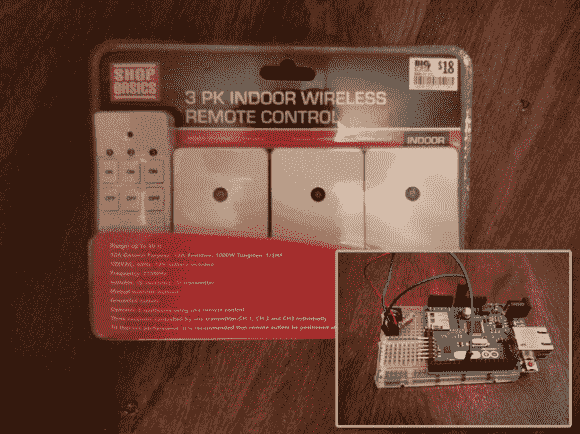

# Android 和 Arduino 射频插座选择器

> 原文：<https://hackaday.com/2013/12/06/android-and-arduino-rf-outlet-selector/>

网络星期一可能已经成为过去，但总会有一些可破解的廉价电子产品出现。无线 Android/Arduino 插座黑客可能是便宜的完美假日项目，尤其是考虑到你可以再次从家得宝抢到[右遥控插座。这个项目类似于我们在这里看到的](http://www.33snowflakes.com/blog/hackable-wireless-outlets-in-home-depot/)[其他遥控插座](http://hackaday.com/2013/01/31/getting-an-arduino-to-control-a-wireless-outlet/)，但是每个插座大约 6 美元:一个难以超越的价格。

[Stephen] Frankenstein 将亚马逊的廉价射频设备[植入他的身体，将 Arduino 连接到发射器上的 4 个引脚。第一步是逆向工程插座的通信，这是通过一些下来和肮脏的](http://www.amazon.com/gp/product/B00FF26R14/ref=as_li_ss_tl?ie=UTF8&camp=1789&creative=390957&creativeASIN=B00FF26R14&linkCode=as2&tag=33snowfl-20) [Arduino 逻辑分析](http://github.com/gillham/logic_analyzer)完成的。最终的电路包括一个标准的 Arduino 以太网屏蔽，它[Stephen]连接到他的路由器上，并被配置为作为网络服务器运行。大部分代码是从 [RC 开关插座项目](http://code.google.com/p/rc-switch/)借来的，但是那个版本的协议是基于美国标准的，不太符合【斯蒂芬】的需求，所以他转向一个[类似的指令项目](http://www.instructables.com/id/Cheap-Home-Automation-using-Wireless-Outlet-Module/)来解决更好的细节。

休息后留下来观看一个快速视频演示，然后查看另一个无线插座黑客获取灵感。

[https://www.youtube.com/embed/57lqu7YIad8?version=3&rel=1&showsearch=0&showinfo=1&iv_load_policy=1&fs=1&hl=en-US&autohide=2&wmode=transparent](https://www.youtube.com/embed/57lqu7YIad8?version=3&rel=1&showsearch=0&showinfo=1&iv_load_policy=1&fs=1&hl=en-US&autohide=2&wmode=transparent)

[Via [Reddit](http://www.reddit.com/r/electronics/comments/1rxn56/hackable_wireless_outlets_at_home_depot/)