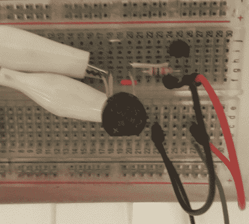

# 安卓门铃通知器

> 原文：<https://hackaday.com/2014/07/07/android-doorbell-notifier/>

发现门上贴着联邦快递的标签，说你错过了一次递送，这总是很不幸的；尤其是你一直在家的时候。在遇到几次这样的问题后，[Lee]决定为他的 Android 手机安装一个[门铃通知器。](http://www.sodnpoo.com/posts.xml/simple_ac_doorbell_to_gpio_interface.xml)

[李]的门铃使用 10 伏交流电源来发出蜂鸣声。为了减少对门铃的改动，他增加了一个集成整流器和一个 PNP 晶体管。铃声响起时，整流器驱动晶体管，将一条线拉到地。

运行 [OpenWRT](https://openwrt.org/) 的旧 Netgear 路由器在 GPIO 引脚上感知到这一点。 [Hotplugd](http://wiki.openwrt.org/doc/techref/hotplug) 用于在检测到按钮按下时运行脚本。

该软件将在另一篇文章中[讨论。路由器运行一个用 c 编写的简单 UDP 服务器。手机使用](http://www.sodnpoo.com/posts.xml/doorbell_to_real_time_android_alert.xml) [SL4A](https://code.google.com/p/android-scripting/) 定期轮询这个服务器:一个用于 Android 平台的 Python 脚本层。综上所述，当门铃被按下时，hotplugd 会向 UDP 服务器发送一个 UNIX 信号。一旦手机轮询服务器，就会出现一个通知，[李]可以毫不拖延地领取他的包裹。