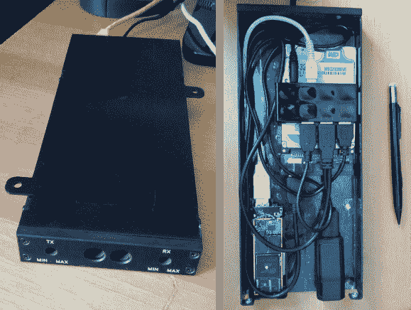

# 安卓棒变异成家庭服务器

> 原文：<https://hackaday.com/2013/07/25/android-stick-mutates-into-a-home-server/>

跟你一直用作家庭服务器的高能耗电脑说再见吧。[Vince Loschiavo]向我们展示了他如何从一个廉价的 Android 棒中挤出大量的功能来管理他家的数字帝国。

他开始只是想要一些网络连接存储。为此，他拿了一个 MK802 Android 棒，如果你找到合适的交易，你可以用一首歌买到它。为了顺从自己的意愿，他告别了 Android 操作系统，转而为 ARM 安装了 Ubuntu。记忆棒(上图中没有它的外壳)以主机模式连接到 USB 集线器，但实际上它从集线器本身获取所有的电力。这使得将 USB 连接到以太网适配器来提高速度成为可能，否则速度会受到 WiFi 连接的限制。有一个 320 的 USB 硬盘用于存储。有了这么大的空间，添加流媒体服务也是有意义的，这很简单，因为它运行的是 Linux。他工作的最后一部分实际上通过谷歌语音和 SIP 电话把它变成了一个星号服务器。一个令人印象深刻的结果在一个讨价还价的价格肯定！ **