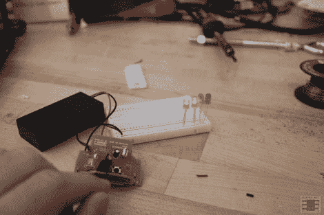

# 另一种自动空气清新剂用途

> 原文：<https://hackaday.com/2012/10/05/another-automatic-air-freshener-use/>

在 hackaday，我们已经看到许多黑客使用空气清新剂。这个有点不同，因为[它使用 PIR 传感器组件](http://www.jcopro.net/2012/10/01/atst-stencil-painting-led-ify-with-an-air-freshener/ "Air freshener PIR (passive infrared) assembly used for LED timer")按顺序打开 led，而不是反转电机。一般来说，马达将被反转，因为这个组件正在反转马达上的电压(参见维基百科上的[【H 桥】 )，但相反，它打开一组 led，然后打开另一组。](http://en.wikipedia.org/wiki/H_bridge "Wikipedia "H-bridge" circuit")

这是因为二极管(LED 中的“D”)只允许电流单向流动。led 相对于电压源是反向的，使它们按顺序点亮。Arduino 或其他微处理器当然可以用来完成同样的事情(见这篇[【HAD】关于收集 PIR 传感器的帖子](http://hackaday.com/2011/10/11/simple-hack-reuses-an-air-freshener-pir-sensor/ "hack reuses air freshener PIR sensor"))。然而，如果你有 10 美元或更少的钱来开始你的硬件黑客生涯，这是空气清新剂被黑客攻击的另一种方式。

休息之后，一定要看看这个简单的黑客视频，用来“LED-ify”一幅星球大战 AT-ST 的画。如果你也对使用空气清新器的齿轮和电机感兴趣，为什么不看看这篇关于用基于时间的模型远程触发相机的文章呢？

[https://www.youtube.com/embed/5beN8mZy4OM?version=3&rel=1&showsearch=0&showinfo=1&iv_load_policy=1&fs=1&hl=en-US&autohide=2&wmode=transparent](https://www.youtube.com/embed/5beN8mZy4OM?version=3&rel=1&showsearch=0&showinfo=1&iv_load_policy=1&fs=1&hl=en-US&autohide=2&wmode=transparent)