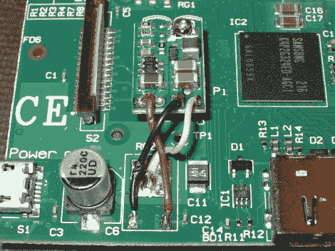

# 另一个开关模式调节器替换为树莓 Pi

> 原文：<https://hackaday.com/2012/07/07/another-switch-mode-regulator-swap-for-the-raspberry-pi/>

[Karl Lunt]正在努力尽可能地降低树莓 Pi 的电流消耗。他旅程的第一步是[用这种开关模式版本](http://www.seanet.com/~karllunt/RasPiRegulatorReplacement.html)替换线性电压调节器。这是一个降压稳压器电路，占地面积小，价格匹配(约 10 美元)[由 Pololu](http://www.pololu.com/catalog/product/2103) 制造。它足够小，可以安装在 LCD 带状连接器和主处理器之间的空隙中。

这个项目是基于我们在 6 月底看到的黑客攻击。但是我们更相信[卡尔]以一种更安全的方式移除了旧的部分。他把两根小导线夹在旧零件的底部，然后用一个结实的熨斗充分加热大垫片，然后再把它的主体移开。旧零件拆下后，只需按照正确的配置连接三根电线。

这减少了大约 50 毫安的消耗。他希望通过移除板上的 led 灯来做更多的事情。他的目标是低于 250 毫安，以便在使用电池时持续合理的时间。