# Apex 电子，您示波器和下降槽的来源

> 原文：<https://hackaday.com/2014/01/21/apex-electronics-your-souce-for-oscilloscopes-and-drop-tanks/>

当一些 Hackaday 的工作人员在洛杉矶参加聚会时，我们决定去一趟 [Apex Electronics](http://www.apexelectronic.com/) ，这无疑是西海岸最古老、最大的电子产品剩余商店。

在 Apex 内部，所有东西都堆放在 20 英尺高的天花板上，任何你能想到的电子元件都堆放在那里。想要一个装满巨大电容器的购物车？太棒了。管座？完成了。任何能想到的电线？那占据了两个过道。测试设备也很多，有示波器、信号分析仪、信号发生器、万用表，甚至还有一对驾驶舱录音机。

在 Apex 还有一个外面的院子，里面至少有两架飞机(其中一架是塞斯纳 150，迫切希望被做成飞行模拟器)，更多的测试设备，成吨的视频设备，几个飞机副油箱，以及足够建造任何东西的铝挤压材料。

如果你想知道 Apex 的价格有多公平，我买了一个包，里面有各种绕线插座(包括一些 64 针插座)，在通常的易贝/中国零售商那里只卖 5 美元，就要 100 美元。[Mike]花 20 美元买了一些步进电机、原型板、一磅支架和一打老式 7 段显示器。不知道测试设备要花多少钱，但据我们所知，价格很低。

我们不是第一个访问 Apex 的 EE/黑客博客/Vlog。[达夫·琼斯] [几年前进行了一次长途跋涉](http://www.eevblog.com/2010/10/30/eevblog-124-a-tour-of-apex-electronics/)并发布了一个很棒的视频。下面你会发现我们旅行的大量照片。

   [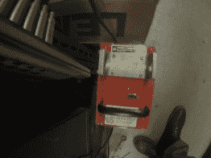](https://i0.wp.com/hackaday.com/wp-content/uploads/2014/01/2014-01-20-gopr0114-28.jpg?ssl=1) Cockpit voice recorder. They had two.     [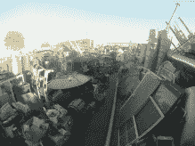](https://i0.wp.com/hackaday.com/wp-content/uploads/2014/01/2014-01-20-gopr0093-20.jpg?ssl=1)  [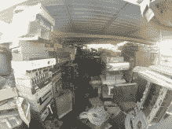](https://i0.wp.com/hackaday.com/wp-content/uploads/2014/01/2014-01-20-gopr0090-19.jpg?ssl=1)  [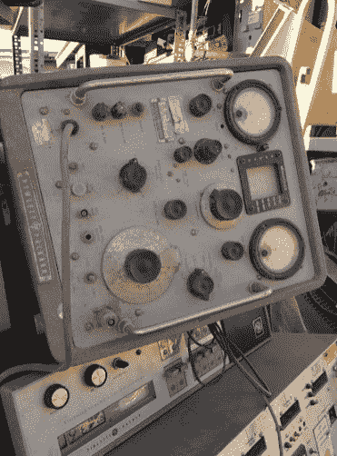](https://i0.wp.com/hackaday.com/wp-content/uploads/2014/01/2014-01-21-img_20140120_162743-38.jpg?ssl=1)            [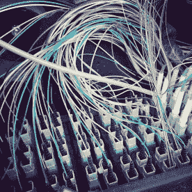](https://i0.wp.com/hackaday.com/wp-content/uploads/2014/01/2014-01-21-49944d44823311e3963412236e9ee816_8-8.jpg?ssl=1)    [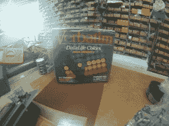](https://i0.wp.com/hackaday.com/wp-content/uploads/2014/01/2014-01-20-gopr0109-26.jpg?ssl=1) Mint in box 5 1/4″ disks! [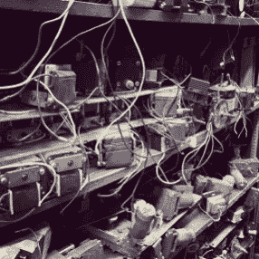](https://i0.wp.com/hackaday.com/wp-content/uploads/2014/01/2014-01-21-71c78046823411e3a6791201ed47478e_8-2.jpg?ssl=1)      [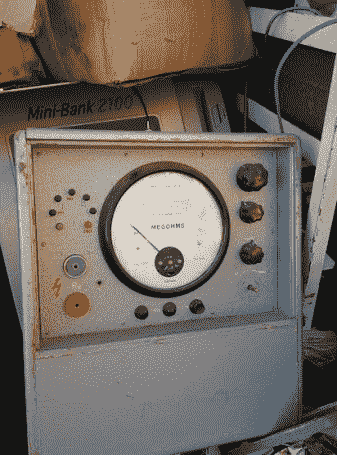](https://i0.wp.com/hackaday.com/wp-content/uploads/2014/01/2014-01-21-img_20140120_163056-39.jpg?ssl=1)  [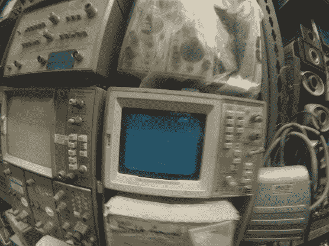](https://i0.wp.com/hackaday.com/wp-content/uploads/2014/01/2014-01-20-gopr0115-29.jpg?ssl=1)      [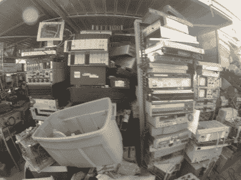](https://i0.wp.com/hackaday.com/wp-content/uploads/2014/01/2014-01-20-gopr0087-17.jpg?ssl=1)    [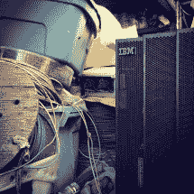](https://i0.wp.com/hackaday.com/wp-content/uploads/2014/01/2014-01-21-eed3cfa0823311e3a0d40eeb204a5406_8-12.jpg?ssl=1)         Soooo much wire [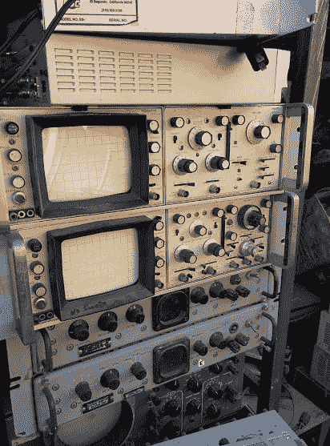](https://i0.wp.com/hackaday.com/wp-content/uploads/2014/01/2014-01-21-img_20140120_162718-37.jpg?ssl=1)  [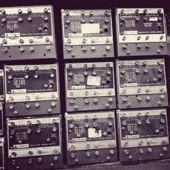](https://i0.wp.com/hackaday.com/wp-content/uploads/2014/01/84e1fd64823411e3b7fe12bbc166bfff_8.jpg?ssl=1)    [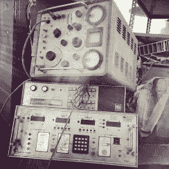](https://i0.wp.com/hackaday.com/wp-content/uploads/2014/01/2014-01-21-ccd0460a823211e3ba4f0a955aaf64ac_8-11.jpg?ssl=1)    [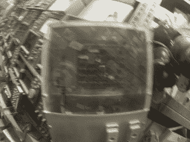](https://i0.wp.com/hackaday.com/wp-content/uploads/2014/01/2014-01-20-gopr0116-30.jpg?ssl=1)  [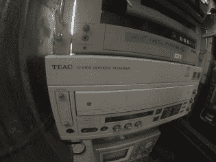](https://i0.wp.com/hackaday.com/wp-content/uploads/2014/01/2014-01-20-gopr0085-16.jpg?ssl=1)    [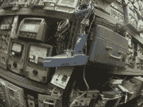](https://i0.wp.com/hackaday.com/wp-content/uploads/2014/01/2014-01-20-gopr0111-27.jpg?ssl=1)  [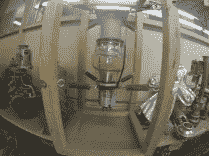](https://i0.wp.com/hackaday.com/wp-content/uploads/2014/01/2014-01-20-gopr0083-14.jpg?ssl=1) Awesome valve 