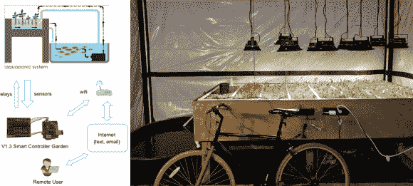

# Aquaponic 系统使用 Arduino 实现一致的性能

> 原文：<https://hackaday.com/2014/08/16/aquaponic-system-uses-arduino-for-consistent-performance/>

食物只是我们生存所需要的东西之一。植物可以在没有人类干预的情况下自行生长，但作物的数量和质量每年都会有所不同。由于天气、疾病、虫子、污染和土壤条件等变量，即使是精心制作的农场也可能有好有坏。

有一个叫做 Aquaponics 的系统试图控制这些变量。水产养殖结合了水产养殖(饲养水生动物)和水培(在水中种植植物)。水生植物系统试图模仿自然界中发生的事情，而没有变化；水生动物吃植物并排泄废物，这些废物被用作植物的食物。

[Kijani Grows]建造了一个[水培设施](http://hackaday.io/project/1877-Smart-Aquaponics)并添加了一个智能控制器，它是由一堆通常不会与花园联系在一起的东西制成的。系统中有几个传感器，用于测量水流、水箱水位、水质和溶解氧。Arduino 监控这些传感器，并将信息报告给运行 OpenWRT 的 20 美元的路由器。所有记录的数据也被存储起来以备以后查看。路由器上的软件决定了在封闭的生态系统中需要调整什么。路由器将这些信息反馈给 Arduino，Arduino 反过来控制水泵、加热器、喂鱼器和照明。如果这还不够，控制系统可以通过电子邮件、短信或社交媒体发送信息。