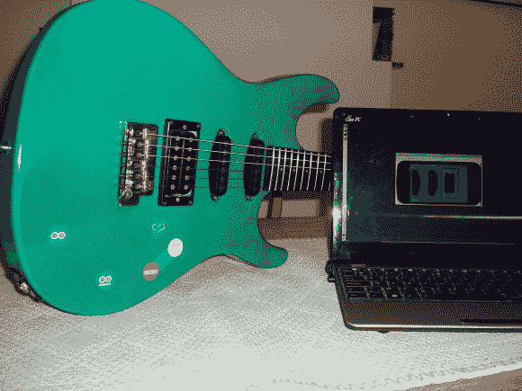

# ArduGuitar，一把 Arduino 可控吉他

> 原文：<https://hackaday.com/2013/09/10/arduguitar-an-arduino-controllable-guitar/>

电吉他有几个开关和电位计，用于控制音量、音调和启用哪些拾音器。[Bob]没有用手摆弄这些，而是建造了 [ArduGuitar](http://www.arduguitar.org/ "ArduGuitar") 。它使用 Arduino 来控制蓝牙参数。这允许音乐家配置预置，然后根据需要调用它们，每次都提供完全相同的声音。它类似于[吉他，但是增加了无线控制。](http://hackaday.com/2013/06/14/guitarduino-show-and-tell/ "Guitarduino show and tell")

ArduGuitar 的内部由 [Arduino Micro](http://arduino.cc/en/Main/ArduinoBoardMicro) 、Sparkfun 的 [BlueSMiRF](https://www.sparkfun.com/products/10269) 和电阻式光隔离器组成。电阻式光隔离器允许 Arduino 通过电隔离栅调节电阻。这可以防止 Arduino 干扰吉他的声音。

第一批电子管中的一些被用来在吉他放大器中制造颤音效果。他们用脉冲将白炽灯照射到光敏电阻上。幸运的是，现在有综合的解决方案。这些是 PerkinElmer 制作的，他们有一个关于音频应用的很好的应用笔记[ [PDF](http://www.perkinelmer.com/CMSResourcimg/44-3429APP_AnalogOpticalIsolatorsAudioApps.pdf "Vactrols App Notes") 。

设计的最后一部分是一个 Android 应用程序，它通过蓝牙提供远程控制。所有东西的源代码都可以在 [Github](https://github.com/gratefulfrog/ArduGuitar "ArduGuitar on Github") 上找到，详细的构建日志可以在[这里](https://docs.google.com/document/d/1NYP5lLS-fnKti_IxXjQsA0Ox2v8w_D1cKuSgbwg5MH0/edit "ArduGuitar Build Log")找到。