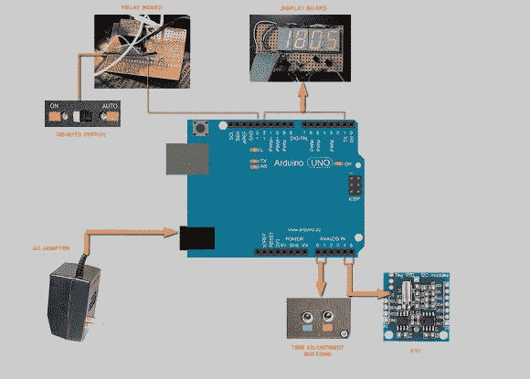

# Arduino 天文钟自动照明

> 原文：<https://hackaday.com/2013/11/15/arduino-astronomic-clock-automates-lights/>

[Paulo]的花园灯可能比街区里其他任何一家的自动化程度都要高，因为它们使用经纬度时钟来决定何时按动开关。【来自遥远未来的编者按:这一页已经不存在了，[但是你仍然可以在时光倒流机上阅读它](https://web.archive.org/web/20131119095342/http://paulorenato.com/joomla/index.php?option=com_content&view=article&id=125&Itemid=4)。TimeLord 库也被取代了，所以您需要做一些移植工作。]

大多数商业选择(和最有爱好的创作)依赖于每天同一时间点击开关的机械开关定时器，或者他们使用光敏元件来决定是否足够暗。两者都不太准确。一片错位的树叶遮住了你的光敏电阻，可能会开启不必要的东西，考虑到日落的实际时间会在一年中波动，机械开关需要不断调整。

[Paulo 的]解决方案解决了所有这些问题，而是依靠一种算法来计算日出和日落时间，[在此](http://williams.best.vwh.net/sunrise_sunset_algorithm.htm)解释，结合 [swiftek 的用于 Arduino 的 Timelord 库](http://www.swfltek.com/arduino/timelord.html)。该建筑具有 4 个 7 段显示器，循环显示当前时间、日落和日出时间。内部是一个 RTC(实时时钟),带有备用电池用于计时，还有一个欧姆龙 5V 继电器用于驱动花园灯。这个特殊的继电器带有一个开关，以防万一，它可以强制打开灯。

查看[保罗的]项目博客，了解完整的文章、代码链接和更多细节，然后看看其他一些家庭自动化项目，如基于短信的加热器控制器或 T2 的房间照明控制。