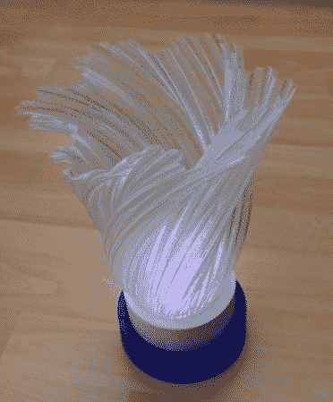
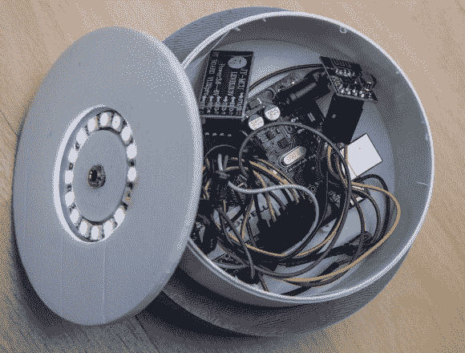

# 基于 Arduino 的 LED 婚礼灯

> 原文：<https://hackaday.com/2014/08/31/arduino-based-led-wedding-lights/>

 

[Rob]为他女儿的婚礼制作了这些[令人惊叹的蓝牙控制 led 灯](http://www.robmiles.com/journal/2014/6/29/windows-phone-wedding-lights-and-bluetooth),为婚礼增添了多彩的氛围。每件物品都有一枚 Neopixel 戒指和一个 Arduino 微处理器，微处理器带有无线模块，可以通过“迷你网络”单独寻址。主主站将接收来自 Windows Phone 的命令。通常我们会看到基于 Arduino 的项目与 Android 应用一起运行，所以很高兴看到微软仍然存在于创客社区中。

设备顶部的外壳和半透明花瓶是 3D 打印的。所有八个婚姻单元彼此同步，颜色可以通过滑动应用程序上的设置栏来改变。[Rob]说建造它很有趣，并开玩笑地说这让他“远离了仪式中所有不太重要的方面”。(食物选择、装饰、地点、结婚对象等)。“结果是婚礼桌面的灯光布置得非常漂亮。在下面的视频中可以看到[Rob]的设置演示。

[https://www.youtube.com/embed/4_SP69N4dkk?version=3&rel=1&showsearch=0&showinfo=1&iv_load_policy=1&fs=1&hl=en-US&autohide=2&wmode=transparent](https://www.youtube.com/embed/4_SP69N4dkk?version=3&rel=1&showsearch=0&showinfo=1&iv_load_policy=1&fs=1&hl=en-US&autohide=2&wmode=transparent)