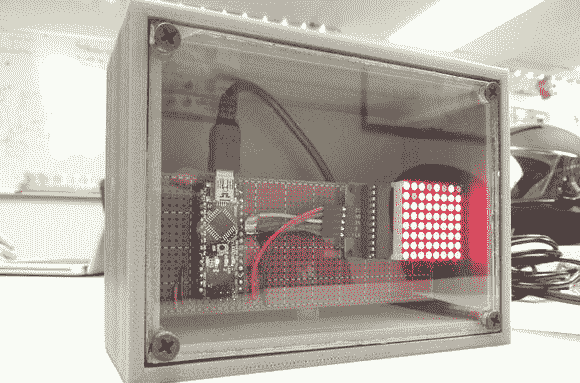

# 基于 Arduino 的厄拉多塞筛

> 原文：<https://hackaday.com/2013/10/10/arduino-based-sieve-of-eratosthenes/>

[暗月歌手]的姐姐即将完成她的数学研究生学位，[暗月歌手]想送她一份与她的成就相称的礼物。自然地，[使用 LED 矩阵和 Arduino 构建厄拉多塞的筛子](http://familab.org/blog/2013/09/sieve-of-eratosthenes/)非常有意义。如果你不熟悉，厄拉多塞的[筛是一种简单但非常有效的寻找素数的技术。从一组数字开始，按顺序一步一步地看。如果它是质数，你从列表中删除任何倍数。几次迭代后，剩下的数都是质数。在运行了 LED 矩阵和筛子算法之后，[Darkmoonsinger]为这个项目设计了一个外壳。她在这一部分犯了几个错误，为了大家的利益，她愉快地把它们包括进来。](http://en.wikipedia.org/wiki/Sieve_of_Eratosthenes)

它只显示 64 以内的质数，她点亮了 1 的 LED，因为这“让阵列看起来更漂亮”。此外，我们不禁认为，以稍微不同的方式安装组件会使安装更干净(这是一个带背光面板的质数[发电机](http://hackaday.com/2010/08/24/attiny2313-prime-number-generator/))。然而，这对他妹妹来说可能无关紧要。正如他们所说的，这是最重要的想法，我们永远不会厌倦看到人们建造而不是购买！