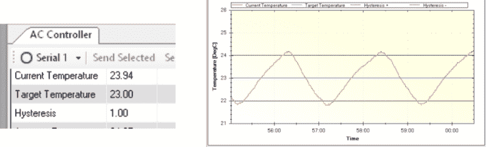

# Arduino 控制的空调

> 原文：<https://hackaday.com/2015/06/11/arduino-controlled-air-conditioner/>

现在夏天来了，是时候开空调了！有一些旧的空调设备仍然工作得很好，但现在我们已经习惯了一切都被远程控制和自动化。[Phil]有一台旧的安装在窗户上的空调，仍然可以工作，但是安装在一个不太方便的地方。要接触空调的控制装置，必须爬过一张大桌子。这是一个绝佳的机会，可以利用大量随处可得的业余电子产品来改造自动交流控制器。

首先，需要有一种方法来打开交流电的电流控制旋钮。[Phil]模拟了一个 3D 支架，将一个 RC 汽车伺服系统固定在 AC 控制面板上。附在伺服喇叭上的是一个开槽的圆柱体，其大小适合控制旋钮的形状。Arduino 通过 DS18B20 温度传感器测量房间的温度，然后让伺服系统将控制旋钮转到适当的位置，开或关。Arduino 通过 MegunoLink Pro 将温度数据发送回电脑，电脑会绘制过去的数据并显示当前的温度数据。使用 MegunoLink Pro，也可以设置最小/最大温度点，而无需向 Arduino 上传新草图。

从温度与时间的关系图来看，房间温度似乎保持在 23 +/- 1 摄氏度之间。[菲尔]帮了我们这些夏日炎炎者一个忙，让他们可以使用他所有的设计文件。这是一个很好的主意，但我想知道让空调单元开关处于“开”的位置，并通过连接到 120vac 线的[继电器打开/关闭该单元是否同样有效。](http://hackaday.com/2015/05/02/door-bell-used-to-reset-wifi-router/)