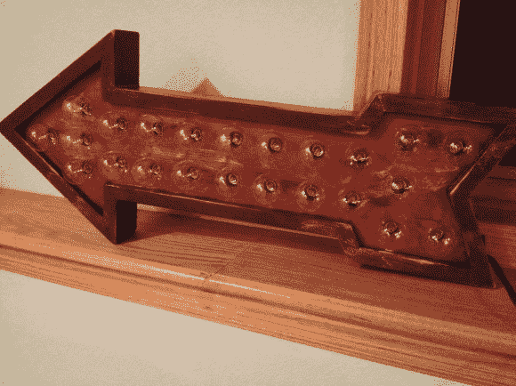

# Arduino 控制的选框箭头指向你喜欢的方向

> 原文：<https://hackaday.com/2014/04/06/arduino-controlled-marquee-arrow-points-the-way-to-whatever-you-like/>

读者[pscmpf]真的很喜欢老式字幕标志的滚动灯光外观，当他看到一些 G40 灯泡的圣诞灯后，他马上就要去[创作自己的复古外观字幕箭头](http://pscmpf.blogspot.com/2014/04/scratch-built-vintage-looking-marquee.html)。

我们必须承认，这些灯泡看起来确实像旧的警灯或小的梳妆球。[pscmpf]从建造、上漆和处理木箱开始，以展示灯光和容纳电子设备。他用 Arduino Pro 和 SSR 控制板控制灯光。这 24 盏灯被分成 10 个部分；每一个都有自己的固态继电器电路，以 MC3042 作为光耦合器，电源由废变压器制成。

[pscmpf]分享了他的部分代码，但不是全部，因为它很长。除了持续的“开”状态之外，还有五种模式，每种模式以三种不同的速度播放。在他跳跃后的演示视频中，他用一个瞬间开关运行了所有的模式。这个黑客证明了 Arduino 控制的圣诞灯一年到头都很棒。

[https://www.youtube.com/embed/HEoir9YzrAc?version=3&rel=1&showsearch=0&showinfo=1&iv_load_policy=1&fs=1&hl=en-US&autohide=2&wmode=transparent](https://www.youtube.com/embed/HEoir9YzrAc?version=3&rel=1&showsearch=0&showinfo=1&iv_load_policy=1&fs=1&hl=en-US&autohide=2&wmode=transparent)