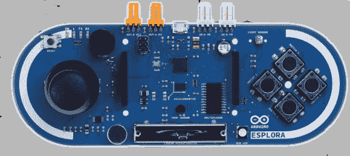

# Arduino Esplora 是一个很棒的控制器

> 原文：<https://hackaday.com/2012/12/11/arduino-esplora-makes-a-great-controller/>

Arduino 的人们似乎在加紧他们的游戏。随着新的 Arduino Leonardo 板能够开箱即用地模拟 USB 键盘和鼠标，这似乎是 Arduino 设计师[推出一款合适的视频游戏控制器](http://arduino.cc/en/Main/ArduinoBoardEsplora)的最佳时机。这种新的电路板被称为 Arduino Esplora，内置足够的按钮和传感器，可以捕捉你可以想象的任何用户输入。

在 Esplora 板上，与最新 Arduino 板上的 ATMega 32U4 微控制器相同。对于输入，设计师包括一个模拟操纵杆，四个轻触开关，一个线性电位计，一个麦克风和光传感器。Esplora 还包括一个三轴加速度计、RGB LED、蜂鸣器和一个 SPI 控制的 TFT LCD 显示屏的插座，以免你想自己重新创建像新 Wii U 控制器这样的东西。

你可以在 Esplora 库的官方网站上查看 Esplora 能做的一切。