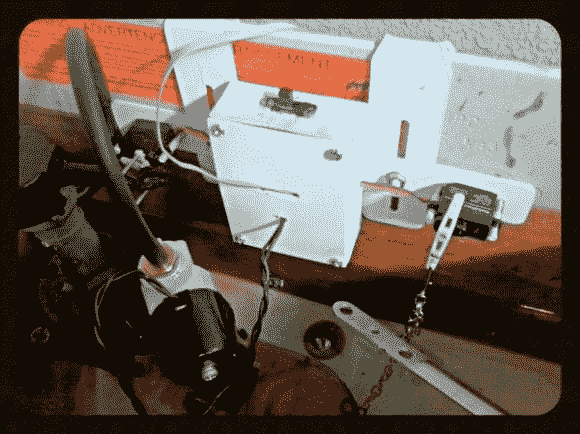

# Arduino 为您提供卫生间选择

> 原文：<https://hackaday.com/2014/08/09/arduino-gives-your-toilet-options/>

随着加州严重干旱的持续，看不到尽头，[TVMiller]决定将 Arduino 和马桶放在一起，尝试每天至少节约几加仑的水。这项发明[将马桶注满到最低水位](http://hackaday.io/project/2206)，平均“用户”每天可节省大约两加仑。

典型的马桶通过重力和移动水来产生真空，将废物吸出马桶。只要马桶里没有固体物质，马桶就能在水量减少的情况下运行。Arduino 会在马桶注满水之前切断水流。

如果任何人——咳咳——需要马桶的全部容量，有一个按钮连接到 Arduino，将水箱注满。[TVMiller]指出，如果 1825 名黑客在他们的马桶上安装了这种设备，我们每年可以节省一百万加仑的水，并且在拯救地球的道路上前进。

该项目网站充满了更多的信息和双关语，供您观赏的乐趣。我们可能会建议“2”按钮也很容易与[厕所恐怖等级指示器](http://hackaday.com/2007/11/14/toilet-terror-level-indicator/)整合。