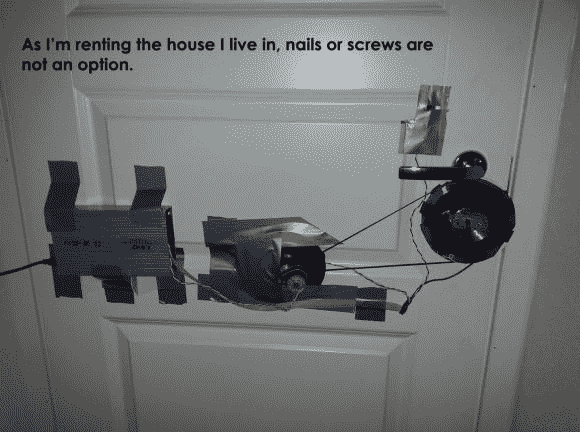

# Arduino 键盘门自动化

> 原文：<https://hackaday.com/2013/11/01/arduino-keypad-door-automation/>

[Andrea]刚刚给我们发来了他为自己房间做的很棒的学生黑客。他建造了一个 [Arduino 键盘门锁](http://www.area51staff.it/doorlock/)——没有使用任何合适的紧固硬件！

整个建筑是由他四处乱扔的废弃零件组成的:一些 DVD、一些木头、一把艾伦内六角扳手、一台坏掉的打印机的电机和皮带、一个旧的硬盘驱动器外壳和一些电源。正如你所看到的，整个装置是用很好的旧胶带艺术地支撑起来的。

系统会在 5 秒钟后自动锁定，以防万一，[Andrea]在固件中硬编码了一些安全代码，允许他强行打开门——你知道，如果门出现故障或其他情况。他对自己的代码不太自信，还让它每 5 分钟空闲重置一次，以防止潜在的内存泄漏——这可能是个好主意！总而言之，这是一个非常酷的建筑，我们不得不为他没有破坏安装它的门而给予他支持！接下来，他还计划使用已经是电路一部分的小扬声器添加一个爆震传感器，因为，[为什么不呢？](http://hackaday.com/2012/03/08/reinventing-the-clapper-with-a-knock-based-home-automation-controller/)

休息后留下来看看这个宏伟的装置，它会让[红绿](http://www.youtube.com/watch?v=5RM6JJb3azE)感到骄傲。

[https://www.youtube.com/embed/32wmwNU7VoM?version=3&rel=1&showsearch=0&showinfo=1&iv_load_policy=1&fs=1&hl=en-US&autohide=2&wmode=transparent](https://www.youtube.com/embed/32wmwNU7VoM?version=3&rel=1&showsearch=0&showinfo=1&iv_load_policy=1&fs=1&hl=en-US&autohide=2&wmode=transparent)