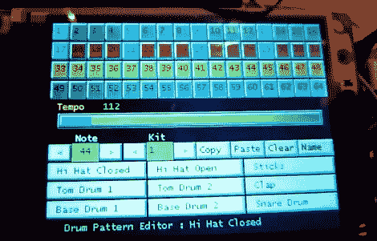

# Arduino MIDI 音序器显示大量数据

> 原文：<https://hackaday.com/2012/04/13/arduino-midi-sequencer-displays-a-lot-of-data/>

这个 Arduino MIDI 音序器有很多方法可以显示循环信息。上面的屏幕是一个触摸感应界面，作为用户输入。但是，如果此屏幕不可见，您仍然可以看到哪些轨道为每个节拍激活了样本，以及正在使用哪些效果。这要感谢在休息后的视频中展示的展板集合。

该设置充当 MIDI 前端，依靠其他硬件来生成样本。它通过 320×240 触摸屏显示器上的几个页面呈现所有选项。Ardunio Mega 负责监控 UI 数据，制作和发送 MIDI 命令，以及更新基于 LED 的显示板。其中包括各种效果的条形图、4 行 16 像素的节拍模式显示，以及用于跟踪循环中当前位置的 7 段显示。总共有 368 个发光二极管，由 18 个移位寄存器驱动。

**更新:**休息之后还可以找到一个图库的链接。

[http://www.youtube.com/watch?v=g93A__xsE6E](http://www.youtube.com/watch?v=g93A__xsE6E)

[画廊](http://r-bau.de/games/thumbnails.php?album=94)