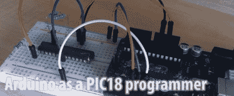

# Arduino PIC 编程器写入 18F 系列

> 原文：<https://hackaday.com/2012/05/04/arduino-pic-programmer-writes-to-18f-family/>

[Kirill]来信分享了他基于 Arduino 的 PIC 程序员。它能够写入 18F 系列芯片，包括 18F2XXX 和 18F4XXX。我们认为这非常令人兴奋，因为这种芯片具有 USB 功能，并且有引导加载程序可以让你通过 USB 对它们进行编程。因此，如果你想建立自己的 PIC 开发板([就像这个](http://hackaday.com/2010/04/13/picman-a-diy-prototyping-setup/))，你可以使用你的 Arduino 来刷新引导程序。

这篇文章紧随 Arduino 被用作 PIC 16F 编程器之后。那个黑客有一个基本的编程图形用户界面，Kirill 承认他缺乏这一点，但他没有计划自己实现它。也许有人会做一些移植工作来合并项目，增加这种编程技术支持的芯片范围。